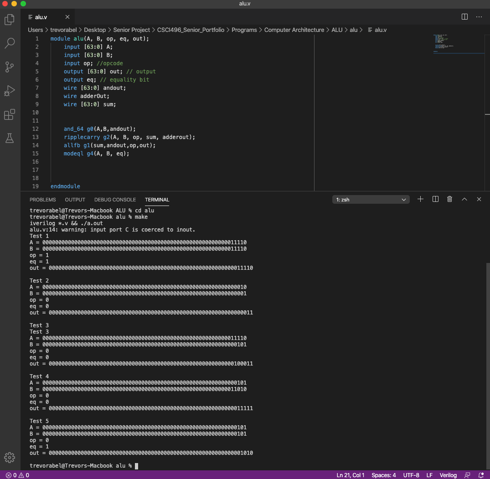

[Back to Portfolio](./)

Arithmetic Logic Unit
===============

-   **Class:** CSCI 330 Computer Architecture
-   **Grade:** 100
-   **Language(s):** Verilog
-   **Source Code Repository:** [Private Github Repository (needs collaborator access)](https://github.com/trevorabel/csci330-alu)  
    (Please [email me](mailto:taabel@csustudent.net?subject=GitHub%20Access) to request access.)

## Project description

The Arithmetic Logic Unit (ALU) is a part of a Single Cycle Proccessor that we designed in Computer Architecture. The purpose of the ALU is to take two inputs and be able to determine if they are the same. It will check over all 64 bits or binary numbers as part of its evaluation. If the ALU determines that the numbers are the same it will throw a flag so that the Single Cycle Proccessor knows that it has two inputs that are the same. If they are not the same then it will just pass along the output of the two inputs and not raise a flag.

## How to compiles / run the program

How to compile (if applicable) and run the project.

```bash
cd alu/
make
```
If this does not work please verfiy that you have Icarus Verilog downloaded and updated on your machine that you intend to run this on.

## UI Design

The UI for this program is the terminal and was not changed in any way for this program. The terminal along with Icarus Verilog is what allows us to run the make file command to compile and run the ALU.v file to produce output to make sure that it works properly.


- Fig 1. This is the shape of a Arithmetic Logic Unit in a proccessor diagram it displays the inputs that it takes and the output that it gives.


- Fig 2. The Arithmetic Logic Unit code that makes the ALU function it includes an equals, 64-bitmux, ripple-carry adder, and a 64-bit and.


- Fig 3. These are the some of the test cases for testing the output of the alu by setting the values either equal or not equal to each other to see if the ALU would trigger itself and raise the flag for when the two inputs are equal.


- Fig 4. This shows the output of the Arithmetic Logic Unit when it runs the supplied test cases. The results are displayed in a binary format to show what a computer would receive and what it would use to function.

## 3. Additional Considerations

When opening the files in Visual Studio Code it will not automatically recognize and color the verilog code. So to help and make it easier to read a great extenstion to install is __**Verilog HDL/SystemVerilog by mshr-h**__ this is a great extenstion that will also recognize errors if any exist like accidentally deleting a semicolon.

For more details see [Arithmetic Logic Unit Private Repository](https://github.com/trevorabel/csci330-alu).

[Back to Portfolio](./)
