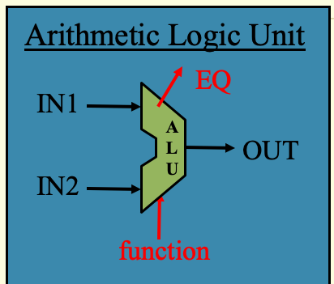

[Back to Portfolio](./)

Arithmetic Logic Unit
===============

-   **Class:** CSCI 330 Computer Architecture
-   **Grade:** 100
-   **Language(s):** Verilog
-   **Source Code Repository:** [Private Github Repository (needs collaborator access)](https://github.com/trevorabel/csci330-alu)  
    (Please [email me](mailto:taabel@csustudent.net?subject=GitHub%20Access) to request access.)

## Project description

The Mortgage Calculator is a GUI based program that runs off of the codepen.io website. This program utilizes three coding languages HTML, CSS, and JS. The HTML provides the structure for the website based GUI telling it where each box, line of text, and button goes. The CSS provides the formatting of the text boxes, padding, text font, text location, and text color. The JS is the section of the code that handles all of the calculatiions with the given information to calculate the expected monthly mortgage payment based on the inital loan amount, the amount of time the loan is held for, and finally the interest rate of the loan.

## How to compiles / run the program

How to compile (if applicable) and run the project.

```bash
cd alu/
make
```
If this does not work please verfiy that you have Icarus Verilog downloaded and updated on your machine that you intend to run this on.

## UI Design

The UI was design to be extremely simple so that it was easy to use and user friendly (figure 1). At its core the UI includes text boxes to input the three neccesary values. After entering the loan amout, the amount of time it is held for, and the interest rate all that you have to do is press estimate monthly payment. After pressing the estimate button it will proccess the information entered and plug it into the JS functions and return your estimated monthly payment in red text (figure 4).


- Fig 1. This is the shape of a Arithmetic Logic Unit in a proccessor diagram it displays the inputs that it takes and the output that it gives.


- Fig 2. The HTML Code that provides the structure of the GUI for the Website so that it displays everything properly.


- Fig 3. The CSS Code that gives the style of the text, text boxes, padding, and give the final output of estimated monthly payment the red text rather than the black standard text.


- Fig 4. Example of how the program runs given the Loan ammount is 100,000 dollars, the borrowing time is 10 years, and the interest rate is 5%. This also demonstrates the fixed red text for the output as mentioned in the CSS screenshot above.

## 3. Additional Considerations

When downloading this repository please download from the releases. The release contains the orignial executable file that shows what the output is supposed to be incase you want to tweak the file.
Running the makefile command will be how to generate the output when looking at the files. If the make command is not working double check that you have Icarus verilog on your computer and it is up to date.

For more details see [Arithmetic Logic Unit Private Repository](https://github.com/trevorabel/csci330-alu).

[Back to Portfolio](./)
