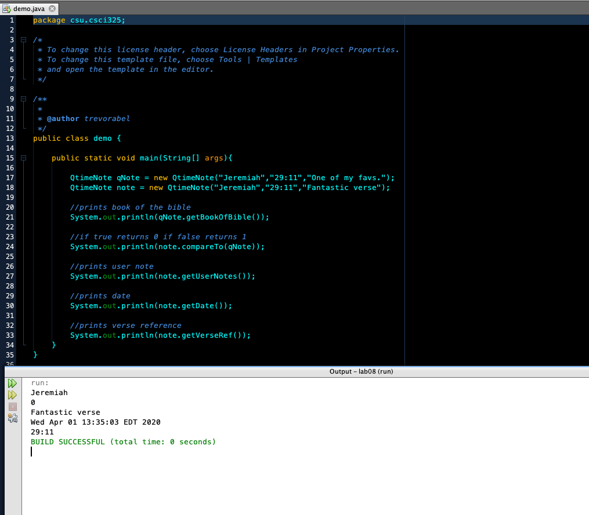
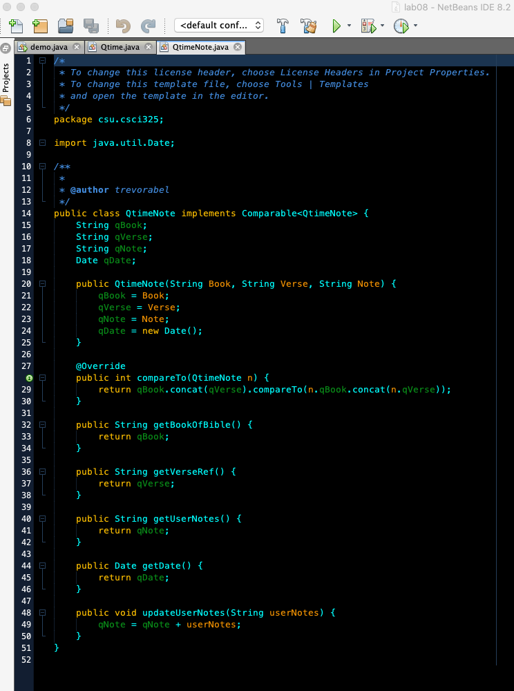

[Back to Portfolio](./)

Book Reference
===============

-   **Class:** CSCI 325 Object-Oriented Programming  
-   **Grade:** 100
-   **Language(s):** Java
-   **Source Code Repository:** [Book Reference Private GitHub Repository (needs collaborator access)](https://github.com/trevorabel/csci325-bookreference)  
    (Please [email me](mailto:example@csustudent.net?subject=GitHub%20Access) to request access.)

## Project description

The Book Reference program was a java program that I created in Object-Oriented Programming and its purpose is to take preset input like in demo. Using that information the demo then calls the funcitons in QtimeNote which uses the Qtime functions and can pull references to books, compare to books to see if they are the same reference, get user notes, get a date, and more.

## How to compiles / run the program

How to compile (if applicable) and run the project.

Use the built in run feature in Netbeans to run this program. 

## UI Design

The UI for this program is just the simple output frame from NetBeans that displays different references to a type of book after it is entered into the demo file. To test other books you must add the information into the demo page of the program just like the other book examples at the top of main.

Fig 1. The launch screen

Fig 2. This is the code that pulls the book references.

Fig 3. This is the code for QtimeNote that takes the input from the user and stores users notes but also is what calls the qtime fuctions to compare or get references.

## 3. Additional Considerations

For easiest use when running this program use the coding program NetBeans. The project was created in NetBeans so it will be easy for it to adapt and run faster.

For more details see [Book Reference Private GitHub Repository](https://github.com/trevorabel/csci325-bookreference).

[Back to Portfolio](./)
