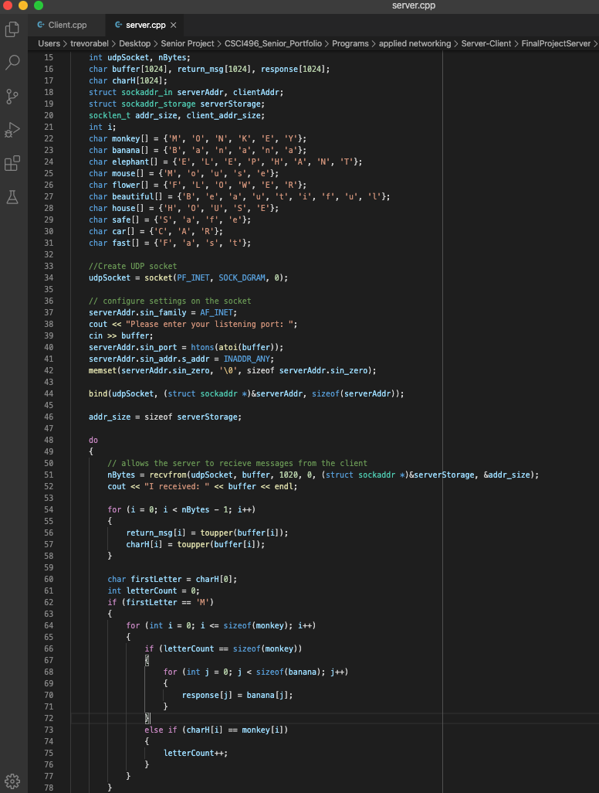
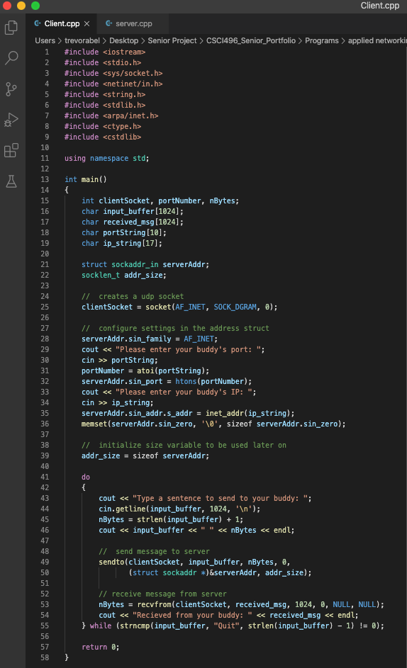
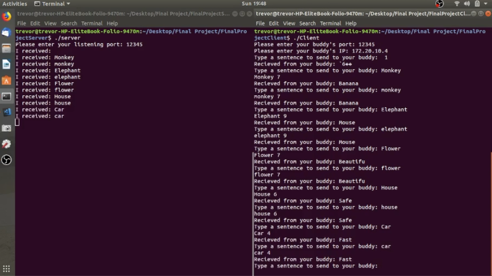

[Back to Portfolio](./)

Server-Client Communication
===============

-   **Class:** CSCI 332 Applied Networking
-   **Grade:** 93
-   **Language(s):** C++
-   **Source Code Repository:** [Server-Client Communication Private Github Repository (needs collaborator access)](https://github.com/trevorabel/csci332-server-client)  
    (Please [email me](mailto:taabel@csustudent.net?subject=GitHub%20Access) to request access.)

## Project description

The Server-Client Communication program replicates on one machine the interaction between a server and a client. The program runs with two seperate terminal windows on the same machine. The user must gather their IP address to use this program and start he Server side first so that they have the adequate information for the Client side.
This program has the client side giving input to the server and then if it is a keyword that the server recognizes it will respond with a message if not the server will not respond.

## How to compiles / run the program

How to compile (if applicable) and run the project.

```bash
ifconfig
./Server
./Client
```

## UI Design

The UI for this program is the users command terminal on a Ubuntu OS. This code was created on Ubuntu so it is optimized for Ubuntu OS systems.


- Fig 1. The graphic illustrates how a server-client interaction takes place.


- Fig 2. This is the server side code with an example of how it recognizes keywords through character arrays it has predefined.


- Fig 3. This is the client side code and shows where it prompts for you to type and then the section for sending out the word and waiting to receive a response.


- Fig 4. This shows the Server and Client on one computer screen being run and showing how the client side recieves the messages from the server side

## 3. Additional Considerations

Please make sure that when you run this you are on a Ubuntu OS for best performance. Also please download from the releases because it has the executable files so that you can test it to see the proper output.

For more details see [Server-Client Communication Private Github Repository](https://github.com/trevorabel/csci332-server-client).

[Back to Portfolio](./)
