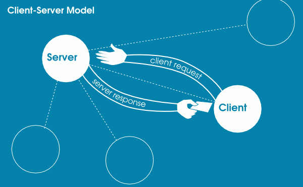
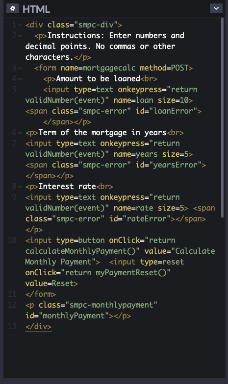
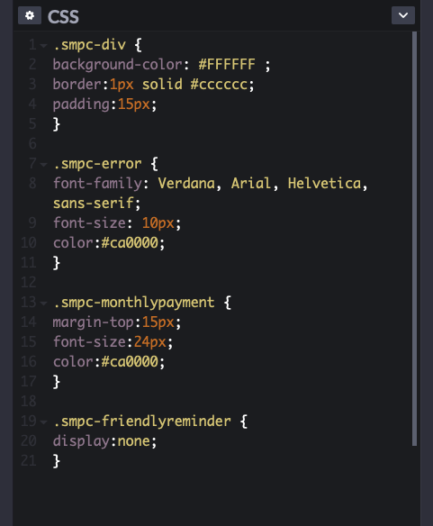
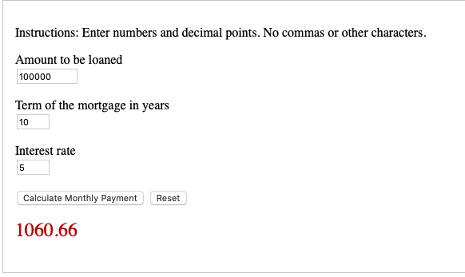

[Back to Portfolio](./)

Server-Client Communication
===============

-   **Class:** CSCI 332 Applied Networking
-   **Grade:** 93
-   **Language(s):** C++
-   **Source Code Repository:** [Server-Client Communication Private Github Repository (needs collaborator access)](https://github.com/trevorabel/csci332-server-client)  
    (Please [email me](mailto:taabel@csustudent.net?subject=GitHub%20Access) to request access.)

## Project description

The Server-Client Communication program replicates on one machine the interaction between a server and a client. The program runs with two seperate terminal windows on the same machine. The user must gather their IP address to use this program and start he Server side first so that they have the adequate information for the Client side.
This program has the client side giving input to the server and then if it is a keyword that the server recognizes it will respond with a message if not the server will not respond.

## How to compiles / run the program

How to compile (if applicable) and run the project.

```bash
ifconfig
./Server
./Client
```

## UI Design

The UI for this program is the users command terminal on a Ubuntu OS. This code was created on Ubuntu so it is optimized for Ubuntu OS systems.


- Fig 1. The graphic illustrates how a server-client interaction takes place.


- Fig 2. The HTML Code that provides the structure of the GUI for the Website so that it displays everything properly.


- Fig 3. The CSS Code that gives the style of the text, text boxes, padding, and give the final output of estimated monthly payment the red text rather than the black standard text.


- Fig 4. Example of how the program runs given the Loan ammount is 100,000 dollars, the borrowing time is 10 years, and the interest rate is 5%. This also demonstrates the fixed red text for the output as mentioned in the CSS screenshot above.

## 3. Additional Considerations

Please make sure that when you run this you are on a Ubuntu OS for best performance. Also please download from the releases because it has the executable files so that you can test it to see the proper output.

For more details see [Server-Client Communication Private Github Repository](https://github.com/trevorabel/csci332-server-client).

[Back to Portfolio](./)
