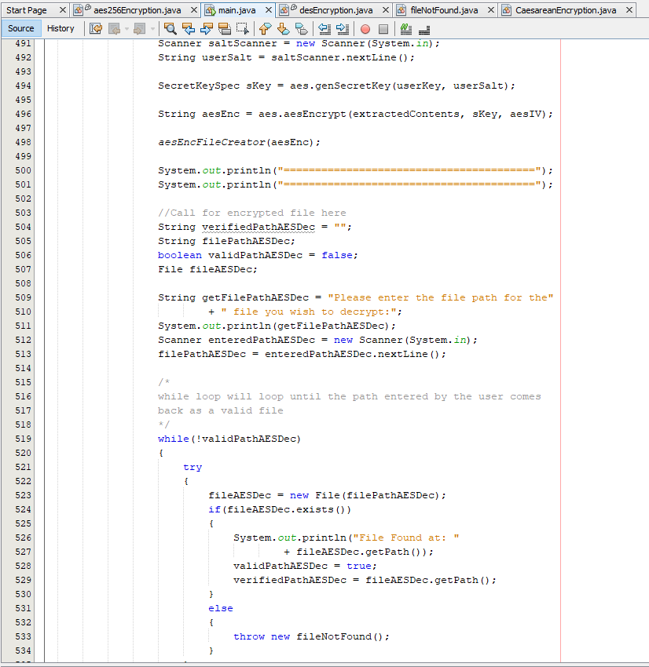

### [Back to Portfolio](index.md)

### [Back to Table of Contents](seniorproject.md)

Senior Project Report
====================

I. Statement of Purpose
-----------------------
Encryption should be a readily available solution for all consumers, not just businesses and government entities. However, consumer-grade encryption is not readily available unless you are prepared to spend money to get it, in the digital age every person has a right to privacy and therefore should be entitled to ways to protect their privacy without having to spend money. In other words, encryption should be free and readily available to the general populace since we all have digital information or records that require protection of some sort. Additionally, we the consumers should be able to select the type of encryption that we want to use while some companies like Windows provide built-in encryption for folders and files by checking a box it is set to one method. This is great because it provides a method of encryption for the general public to have access to without having to pay someone to do it. 

However, there is a downfall to this method, it is that if someone cracks one version of the encryption method it will be easier for them to crack another and then a hundred more after that. This is the limitation of having a singular publically free encryption method. Also, the free encryption programs while beneficial for the average user they present a major risk for those users because free software does not always put security first when it comes to customer information and their company's products.

Everyone wants to find the best deal or get it for free when they can however, free software can pose extreme harm to you, your assets, or your company. This brings this to the forefront of what is important in today's world and society at an unprecedented time of technological spread and digitization, privacy is something that lately has not been as talked about. Now, with the rise of cyber attacks and security breaches the question of security of our personal and private information is finally coming to the forefront of discussion.

Personal data such as medical records, banking records, tax records, or other online records have immense value to the owner of those documents and if they are compromised it can lead to immense financial, reputational, emotional, or physical harm to that individual. This is illustrated in a paper on the European Union Agency for Cybersecurity where they say, "Data is considered to be the gold of the digital age... Data has become an important commodity generating profits on its own;" this shows that there is not only value but power in our data [1]. Our data today has more value than our vehicles, houses, vacation homes, and even some of our bank accounts. The true price of someone's private personal data is priceless because so much damage can be done to a person simply by taking some seemingly insignificant personal information. An article in Forbes says, "Of course, when you give multiple third parties access to your company's data, you increase the risk of that data being stolen or used in ways that don't benefit your organization." this is a very common saying but its one of the most truthful representations of security in the digital age [2]. Allowing access or connection between accounts provides great seamless use for many applications like Facebook and Spotify, you can use your Facebook account to sign up for Spotify however, it means that if Spotify gets compromised your Facebook credentials could also be compromised. It is estimated that we spend on average 6 hours and 42 minutes a day on the internet, which equates to almost 100 days a year, it is strikingly clear that nowadays we spend a monstrous amount of time online [3]. While we spend so much time online the other thing that is growing exponentially with the amount of time online is the number of sensitive documents that are uploaded, shared, downloaded, and stored online. This means that the security of these documents and information is becoming a major concern. 

A solution to remedy this problem is to develop a widely spreadable localized encryption program. This program would function based on the machine it is installed on using its components to generate all the necessary parts making them unique to the computer and creating this program allows for user customization to the actual program itself. Providing customization to the actual methods of creation for the encryption can increase the difficulty of cracking one of these algorithms. Conversely, it can make someone unfamiliar with security, programming, or encryption a higher risk target than intended because they can make the algorithm weaker unknowingly. However, for the vast majority of the populous, they stand to benefit from some form of free available customizable encryption software that they can use exclusively for their important documents.

The benefits of this solution are that once the product is bug tested and operational there will be a free distributable version of a customizable local encryption program. The program will be useful for those looking to take the contents of a file and place them in a text file and be able to encrypt them so that only they can know the contents of that file. This adds a layer of protection to that file that contains personal information that could be used against them if someone were to get their hands on it. There are limitations to this program in its first version state like it can only be operated with .txt files so there are restrictions to its operation and its capabilities. However, this is still better than having no encryption on personal information files. Having even any encryption on it provides time to react to secure information and change passwords that you would not get if there was no encryption at all on the files.

The creation of a free customizable encryption program for the general populous would educate the populous on the importance of data security but also provide them a way to act on the new information and take steps to protect their data. Then for those who are already educated on the subject matter, it would provide them a local method of encryption that they can customize to increase their security on their information files or system. The alternatives of paying for this service mean that you get support for it and you get it sooner than a local program that you need to run however, the idea of security of personal information should not be something that the general populous has to pay for especially when the things at risk of unsecured personal information is their livelihood and their financial, emotional, and physical well being.

  
II. Research & Background
-------------------------
The National Institute of Standards and Technology (NIST) recognizes the need for end-user encryption for their devices or files and that in the digital age this need is growing exponentially. The term End-User Device is used to describe, "Any desktop or laptop computer, any tablet, smartphone, or other mobile device" as described by the University of Chicago and further mentions that USB drives or removable media does not count as an End User Device [4].NIST recognizes the need for storage security for individuals due to the precedent set by the security necessities set by the government with the following laws: Federal Information Security Management Act of 2002, OMB Memorandum M-06-16, Privacy Act of 1974, Gramm-Leach Bliley Act, and Health Insurance Portability and Accountability Act of 1996 [5]. These federal laws and regulations set forth the precedent for the protection and storage of personally identifiable data and health records. This set a standard for organizations to follow but nothing for establishing a precedent for the importance of encryption for personal use. The lack of a precedent on the necessity for personal use encryption, a market opened for privatizing personal use encryption so those that wanted it had to pay for it.

The second major category of available public encryption is disk encryption. This is one of the more common forms of encryption for the average consumer who needs encryption. However, to do this typically will require reformatting of a hard drive or solid-state drive which most people would not do unless they have a brand new laptop or desktop. Additionally, some software is not compatible with hard disk encryption. One of the most common applications for desktops, especially those built by teens and young adults, Steam, is not compatible with encrypted hard disks. No modifications can be made to the application to allow for compatibility with encrypted hard disks.

In the present day, the value and focus of personal encryption are in health care encryption. While this is beneficial, this is also limiting to the utilization of personal use encryption. The benefit from this is that especially now in a global pandemic with COVID-19 we can hold virtual doctor's appointments and transmit medical records comfortably using encryption standards. However, there is no reason to stop at just medical records since nowadays any personal data has more value than most of our possessions.

In a paper published in 2005 titled, "New Methods in Hard Disk Encryption" it is stated that since our processors have become more powerful in the last decade that hard disk encryption has become more available to the public than it was previously. However, it also says that CBC is the most used cipher mode for hard disk encryption [6]. This is because the average consumer does not know how to alter the settings to their hard disk encryption method. This means that although each instance of hard disk encryption is separate they are using the same method which makes it less secure with each one before it that is broken. This can open many issues with security if it is something that can compromise individuals' data by simply not giving them the option to choose their encryption methods.

Sometimes full hard disk encryption is not even necessary or it is not feasible to make a backup and wipe the drive just to reformat it to an encrypted disk. In these instances where you just need one or more files encrypted but not everything else something like a program that encrypts files or file contents is much more beneficial to the average consumer. In this case, my solution to this by creating a customizable encryption program would benefit this demographic of consumers.

My solution will attempt to mitigate this void left by the absence of free customizable end-user file encryption. The first iteration of this project will include Caesarean encryption, DES encryption, and AES256 Encryption. These methods will all be customizable as the code for the methods will be available for the end-user to examine and modify as they see fit. This will also be free so that it meets the demand for encryption that is not currently available outside of disk encryption. The purpose of this first iteration is to develop encryption software for file contents with later versions focusing deeper into content encryption with more methods and full file encryption as well for the current and new methods.

III. Project Languages, Software, & Hardware
--------------------------------------------
Project Language: Java

Software: Netbeans 11.0 IDE

Libraries:
----------
- IO Libraries
  - java.io.File
  - java.io.FileNotFoundException
  - java.io.FileOutputStream
  - java.io.IOException
  - java.io.InputStream
  - java.io.OutputStream
  - java.io.PrintWriter
  - java.io.UnsupportedEncodingException
  - java.io.BufferedReader
  - java.io.FileReader

- Util Libraries
  - java.util.Date
  - java.util.Base64
  - java.util.Base64.Decoder
  - java.util.Arrays
  - java.util.Random
  - java.util.Scanner
  - java.util.concurrent.TimeUnit

- Crypto Libraries
  - javax.crypto.Cipher
  - javax.crypto.CipherInputStream
  - javax.crypto.CipherOutputStream
  - javax.crypto.KeyGenerator
  - javax.crypto.NoSuchPaddingException
  - javax.crypto.SecretKey
  - javax.crypto.spec.SecretKeySpec
  - javax.crypto.SecretKeyFactory
  - javax.crypto.spec.IvParameterSpec
  - javax.crypto.spec.PBEKeySpec
  - javax.crypto.BadPaddingException
  - javax.crypto.Cipher.SECERT_KEY
  - javax.crypto.IllegalBlockSizeException

- Security Libraries
  - java.security.InvalidKeyException
  - java.security.NoSuchAlgorithmException
  - java.security.InvalidAlgorithmParameterException
  - java.security.spec.InvalidKeySpecException
  - java.security.spec.KeySpec

- Senior Project Libraries
  - seniorProject.desEncryption.desFileCreator
  - seniorProject.desEncryption.desFileCreatorDec

- Other Libraries
  - java.sql.Timestamp
  - java.nio.charset.StandardCharsets
  - java.lang.reflect.Array

Packages:
---------
  - seniorProject

Hardware:
---------
  - Laptop or Desktop

IV. Project Requirements
------------------------
*Check this document for the Project Requirements*

[View Requirements Document Here](requirements.pdf)

V. Project Implementation Description & Explanation
---------------------------------------------------

Introduction
------------
This project, the text file encryptor project, is a culmination of all the information that has been presented in the Computer Science classes offered at Charleston Southern for the Bachelor's degree in Cyber Security. The project is in fulfillment of the requirements of graduation and is the focus of the senior project sequence where the Text File Encryptor was developed. This project was designed, coded, tested, and completed within the sequence of the senior project classes starting at CSCI 497, Senior Project Design, and going through CSCI 499 Senior Project Defense. 

Goals & Objectives
------------------
For the implementation of the file encryptor project, there are a few main goals. First, produce a fully working text file encryptor. Second, make this text file encryptor segmented in its respective areas so that the encryptor itself can be customized. Thirdly, have a working product that can be released for free to address the lack of free encryption choices for individual files and the lack of ability to choose the desired encryption method.
The objectives of this project include the following: develop a stronger understanding of Java-based security classes and structures, learn how to properly separate core functions of encryption from the rest of the program to create a program that is easier to modify, and produce a product that is a sufficient fulfillment of the senior project sequence for the requirements of graduating with a Bachelor's degree in Cyber Security from Charleston Southern University.

Tasks
-----
For this project, it is broken down into simple stages for the components that are necessary for this project to be fully functional.

1. Caesar Encryption
2. Caesar Decryption
3. DES Encryption
4. DES Decryption
5. AES256 Encryption
6. AES256 Decryption
7. Functionality for recursion to repeat encryption/decryption
8. Functionality for File input validation
9. Functionality for saving a file directly to the desktop/specific folder
10. Functionality for creating a new folder automatically for each new encryption and decryption
11. UI for navigating through the program
12. BufferReader for reading the original file and converting it to a string
13. Creating FileNotFoundException for invalid file location call

Implementation Schedule
-----------------------

- Feb. 28, 2020
  - Implemented System Baseline
    - Caesarean Encryption/Decryption
    - File Path Searching
    - Oupting encrypted or decrypted files to new files created files
    - Input validation for file path searching
    - BufferReader method to pass file contents into a string
    - FileNotFounException

- May 20, 2020
  - Completed encryption or decryption choice at the beginning of the program
  - Implement recursion within the program to encrypt/decrypt multiple files in one program run
  - Completed the rerouting of the program-created encrypted and decrypted files back to the desktop instead of the java project folder

- Nov. 20, 2020
  - Implemented DES encryption/decryption and tested for accuracy

- Jan. 11, 2021
  - Implemented AES256 and tested for accuracy

- Jan 12, 2021
  - Begin testing and collecting usability and bug case information for project defense

Code Screenshots
----------------

Fig. 1 FileNotFound class that throws the Invalid File Location error when an improper path is entered while searching for a file.

Fig. 2 Caesarean Encryption global variables, constructor, passing file contents, and description methods.

This image shows the constructor for the Caesarean Encryption class, the method that passes only the text into the class, and the beginning of the description of the cipher.

Fig. 3 The description of the Caesarean encryption method and the beginning of the actual encryption.

Fig. 4 The rest of the Caesarean encryption method and the beginning of the decryption method.

For the encryption, it shows how when the file contents and the selected shift key are passed through that the for loop works one character at a time when switching to the shifted ciphertext. In the if loop within the for loop it shows that the way that the characters are determined is by their ASCII values so values 97 through 122 represent the lower case characters while 65 through 90 represent the upper case characters. For both upper and lower case, the process is similar so it takes character variable ch and pulls one character from the file text string variable that has the whole contents of the file. Next, the selected character is run through another if loop that checks to see what the current value is so that it can accurately loop back to the start of the alphabet for the respective case of that character. After that, the character is passed to the string variable called altered, this variable stores each character that has been changed until the original string has been completed changed by the shift key. Then the string is passed to be stored into a new file to mark the end of the encryption.

Fig. 5 Decryption of Caesarean encrypted text and other methods to get and set information for the encryption.

For the decryption of the Caesarean encryption method, it is the same as described for Fig. 3 and Fig. 4 but instead of encrypting the contents, it decrypts it. So everything is the same until it gets to modify the character itself at which point it works backward or the opposite way that the encryption shifting works. Similarly, the character variable ch for the currently shifted or to be shifted variable is stored after being shifted into the string variable called decay. Then that string variable is returned to be stored into a new file to complete the decryption.
The methods getShiftKey and setShiftKey both deal with the value of the shift key for the instance of the Caesarean encryption class. The getShiftKey is useful if you forget the shift key and have not moved to another instance. While the setShiftKey is useful for adjusting the shift key if necessary for whatever reason.

Fig.6 Shown in this image are all the libraries necessary for the function of the DES encryption class.

Fig. 7 Displays all the global variables for the DES encryption class.

Fig. 6 and Fig. 7 show all the libraries and all of the global variables for the functionality of the DES encryption class. Some of these variables like selected and padding are not necessary they just save space when typing out their respective parts during the coding of the actual encryption. These variables are just prematurely declaring the type of encryption and the type of padding to use for the DES encryption and decryption.

Fig. 8 DES Encryption description and the encryption method for DES.

In the encryption of DES, it shows that the variables passed in are types input stream and output stream. Additionally, there is an exception that is thrown which is the IOExecption otherwise not throwing it will not allow the method to work. First, the KeyGenerator library is used to prepare to generate the secret key. The global variable sKey is used to store the key generated by the KeyGenerator library instance. With the encrypt cipher variable it is setting up for the type of padding being used for the DES encryption. Then the encrypt cipher variable is used to generate the DES encryption to be used to encrypt the file text.
Then an output stream is created so that the encryption can be written out to a new file. Then the methods write data is called using the is, input stream variable, which holds the contents of the file and os, the path of the new file.

Fig. 9 DES decryption and the write data method for sending the encrypted text out.

Similar to Fig. 8 the decryption uses the same structure to generate with padding and then the variable decryptCipher to create the decryption to be used against them is a variable that holds the file text. The write data method is responsible for pushing the encrypted or decrypted text out to the new file to mark the end of the encryption or decryption. 

Fig. 10 The desFileCreator method is used in the main class to create the new file for that encryption.

First, it catches everything into a while loop where the condition is !real which means not real, the real variable is a boolean variable that by default is set to false so once it is set to true it exits. The purpose of this is the real variable is the only variable controlling the loop until a file name is available. Then it steps into the if loop where the major condition is if the directory file exists if so then it enters a for loop where it goes up to 100 times per encryption or decryption, so up to a total of 200 times for the pairs of encryption and decryption.
Then the file path is broken down into parts so that an iterator can add one and keep the same name with a different number to be able to create new linkable files. Once a new file name is found it spits back information that lets the user know that the new path has been put into a string to be used for creating the file. Then says sets real to true which means that it has found a real file name. Then using the new file path string a file name is attached which is DESEncrypted.txt, all DES-encrypted files have this name but are separated by their folder number in the order they were made.

Fig. 11 Contains the final steps of desFileCreator in which the new path is passed so the file is created at that path and shows the start of the decryption version of the same file creator.

Fig. 12 Shows the end of the desFileCreatorDec which is the same as the encryption version just specialized specifically for decryption.

The above desFileCreatorDec is the same as the desFileCreator the only difference is instead of naming the files and folders DESEncrypted/DESEncryption# it is DESDecrypted/DESDecrypted#. Then using the new file path string a file name is attached which is DESDecrypted.txt, all DES decrypted files have this name but are separated by their folder number in the order they were made.

Fig. 13 AES256 Encryption libraries that are necessary for functionality.

Fig. 14 AES encryption method returns as a string to the main class.

This screenshot shows how the text is encrypted in AES256 format. First, the Cipher class is used to generate the AES padding instance to prepare for encryption. Then the cipher instance AESCipher is used to generate the AES256 encryption using the declared mode, secret key, and the IV. Finally, the text is encrypted with a base64 encoder and passed all the previous requirements for the AES256 encryption to occur.

Fig. 15 AES decryption method and genSecretKey method.

Here is how the secret key is generated for AES256 encryption. Using the SecretKeyFactory class to generate the padding instance so that the secret key can be generated. Then the KeySpec class is utilized to make the next step in the secret key by taking the user inputted word, salting, and declaring bounds, and the type of AES. Next, the SecretKey class is used to generate half of the secret key, and finally, the SecretKeySpec class is used to make the full key.

Fig. 16 AES256 genIV method to make the IV for encryption and decryption.

For AES256 the IV must be 16-bytes long and this was done using the random number generator as opposed to making the user do it, for stronger security. First, instantiate a new 16-byte array and a new instance of the Random class. Using the Random class fill the IV array and return that array for use in encryption and decryption.

Fig. 17 Main class and all the libraries needed for functionality.

Fig. 18 The main class is driven by one line which references the methods in the main class.

Fig. 19 AES256 encryption testing, IV array testing, and keygen testing for AES256 encryption commented out.

Fig. 20 Testing for a functional iterator-based file creator for making new files and folders.

Fig. 21 Start function that has blank lines and banners for displaying necessary text.

The twelve blank lines allow for all the comments at the start of a program in Netbeans to be moved out of view so it is just the banners that contain basic project information such as the project name and my name.

Fig. 22 Selection method where the user selects which encryption they wish to do.

With the current state of the project, there are two issues, one is that both DES and AES256 functionality on its current implementation does not allow for multi-encryption without decryption like Caesar's implementation so it must encrypt and decrypt or it can not be decrypted. Secondly, AES256 decryption is currently bugged and stuck in a base64 error loop with no solution currently the AES256 can encrypt but not decrypt.

Fig. 23 The top shows how the program operates where after a choice it calls another section or just exits and quits.

Fig. 24 How the program looks for the file that the user wants to encrypt.

At the end of Fig. 23, it shows the beginning of the searching that the program does to find a file name that the user wants to encrypt. This is trapped in a while loop like the file creator so it will repeat until the proper conditions are met and in this case, it is that the entered file path leads to an actual file. If it is miss-typed or it is a file that does not exist it will prompt the user to try again until they get it right and the file name matches an existing file.

Fig. 25 Switch statement for the encryption methods for Caesarean, DES, and AES256.

In this switch statement case 1 or Caesarean takes up much less room because compared to DES and AES256 it is a much simpler encryption method so it does not need as much to function. After each encryption is complete the program will recursively call back to the selection method to allow the user to make another encryption, do decryption, or simply exit the program. Additionally, in the lower half of the screenshot, it shows the warning statement that DES has limited capabilities where it must decrypt after encrypting or it can not decrypt it at all.

Fig. 26 DES encryption and DES decryption.

The scanner at the beginning of the screenshot is simply to make the user acknowledge by pressing a key that they are using a limited encryption method. Then the desEncryption class is instantiated with a blank string so that the instance is made, then the instance is used with calls to the file path from earlier and the desFileCreator method for the generation of its output file. After it is done encrypting it will spit a message out saying that it is starting the decryption process at which point the user will have to enter the location of the newly encrypted text file.

Fig. 27 File location validation for DES decryption.

Just like for the initial file validation when they need to enter the encrypted file path there is also file path validation just to ensure that they get the right file and do not have to restart the program and begin the process over again. After the file path is validated it is passed into the same instance of DES so the key remains the same which is vital for decryption. Then it is decrypted and the desFileCreatorDec method is used to generate the new file and it calls back to the selection method.

Fig. 28 Similar to DES the AES encryption and decryption starts with the warning.

This warning is the same as the one for DES since encryption and decryption must be done at the same time. Then the AES class is instanced so it can be used for encryption and decryption. First, the genIV method is called so the IV will be ready for encryption then the user is prompted for both a phrase for their secret key and their salt.

Fig. 29 AES256 encryption occurs then the decryption begins.

After the user enters both phrases for encryption the encryption is done and the decryption begins. Just like with the DES decryption there is file path validation for the AES256 decryption file input.

Fig. 30 AES256 file decryption with a time delay to mimic phrase validation.

Here the file is read in and there are cuts made to the file text so that it is readable for the decoding such as removing newline characters, \n, then it is requested for the user to enter the two phrases they used earlier. All of that information is passed to the decryption method to be decrypted, if the phrases do not match however there will be no decryption. After the decryption is complete it calls back to the selection method.

*Note: Currently due to a base64 error loop the decryption for AES256 does not function 04/05/2021*

Fig. 31 Decrypt method for Caesarean decryption.

First, the user must pass the file validation check before proceeding to the decryption of Caesar encrypted files.

Fig. 32 Here is the statement and the switch for selecting decryption methods.

While DES and AES256 are listed as decryption methods currently they do not have a functional stand-alone decryption method but are still listed since future enhancements will have this functionality. Once the user selects cesarean decryption the encrypted file contents are passed and the user is asked for their shift key to decrypt it.

Fig. 33 The attempt at DES decryption.

These are the remnants of the attempt at making a separated DES decryption but since these are two different instances the secret key is different so it was commented out until a solution can be found. Same for AES256 since it also deals with instanced keys that are needed to decrypt.

Fig. 34 Caesarean encryption method.

The method takes a string variable that contains the contents of the file and turns it into a caesar encrypted text with the user input for the shift key. Then it has its file creator similar to the DES one so it has its file creating system.

Fig. 35 Caesar encryption file creator and time stamp for file.

Fig. 36 Caesar decryption method.

Fig. 37 Caesar decryption file creator and time stamp for file.

Same as in Fig. 34 and Fig. 35 however, it decrypts then creates its file to store the decryption.

Fig. 38 Main class DES encryption and decryption methods.

This is the remainder of the first attempt at creating the DES encryption and decryption before realizing that both methods had used two different instances at which point the transition was made to encrypt and decrypt right after.

Fig. 39 AES encryption file creator.

Fig. 40 AES encryption file creator (cont).

Similar to the DES and Caesarean encryption file creators but for the AES256 encryption method.

Fig. 41 AES decryption file creator.

Fig. 42 AES decryption file creator (cont).

Similar to the DES and Caesarean decryption file creators but for the AES256 decryption method.

Fig. 43 Password verification method for AES256 decryption.

This is a boolean method that checks to make sure that the entered key phrase and the entered salt phrase match so that decryption occurs when these are both matching as a method of verification that it's the same person.

Fig. 44 Password verification (cont) and bufferedReader method.

The password verification method shows what the check is for if one or both of the phrases is wrong. Then the buffered reader method is what is used to take the contents from the file path query and retrieve the text from inside the file and put it into a string so that it can be encrypted.

VI. Test Plan
-------------
Project Development Test Plan
-----------------------------
The attached test plan covers the attempts made while testing the features of the File Encryptor project to get each part functional for testing.

Note: The AES256 Decryption method was stuck between 3 different errors dealing with Improper array length, Base64 decoder error, and invalid character errors. While debugging and resolving the invalid character errors a Base64 decoding error occurred. After debugging and resolving the Base64 error the Improper array length error occurred and in attempting to solve it ended back at the invalid character errors. Attempting to solve all three errors lead to a continuous loop of errors with no clear exit to a finished decryption method.

*See attached excel document for the Test Plan for the development of the senior project.*

### [Link to Test Plan](File%20Encryptor%20Test%20Plan%20-%20Trevor%20Abel.xlsx)

Project Testing Plan
--------------------
For the testing of the project, it is important to hit the major components of the project to ensure that they are functional as they are supposed to be for the primary functionality of the project. The means that the following key elements are going to be tested in the participant testing phase to ensure accuracy and input validation.

1. Input validation for file pathnames
2. Input validation for method selection
3. Input validation for Caesarean cipher shift (only allows numbers 1 - 26)
4. Caesarean encryption cipher shift
5. Caesarean decryption reverse shift
6. BufferedReader method to pull text from the file
7. DES instanced encryption to encrypt file text
8. DES instanced decryption to decrypt the encrypted file text
9. AES 256 encryption generated IV and Secret Key for creating encryption
10. AES 256 decryption passing the ciphertext, IV, and Secret Key for decryption

The above elements are vital to the operation of the project, therefore, are the foci of the user testing phase to receive feedback and see the operation of these elements while being operated by someone with no background on the project.

Input validation is one of the most important features of this project so that the project can not be derailed and broken since for this project security is the key this needs to be a primary concern as to not leave holes in the project to be exploited. The secondary concern is focused on the success of the actual encryption and decryption methods since outside of the validity of the inputs they are the core of the project so they need to be properly functional. These two categories make up the vast majority of what is critically important to the success of this project which is why they have been chosen as the features to be tested in the user trial phase.

How each element is to be tested
--------------------------------
- Element 1
  - Each run through the encryption and decryption process a proper file name is needed so it will be tested correctly through each use but alternatively an improper file path name will be used to ensure that for improper files that it makes the user try again. In this case, the term improper file path name means that the file does not exist on the specified file path name.
- Element 2
  - Each run is dictated by a series of switch statements where the user will select a number 1 through 3 to perform various tasks such as selecting a method, starting encryption, starting decryption, or simply exiting the program. The input will be validated by operating through the series of switch statements using the appropriate numbers but also by using numbers outside of the 1-3 bounds to test to make the program require another input from the user.
- Element 3
  - Every Caesarean shift requires a shift key and for the cipher in this program, the shift key is determined by the user so that they may be able to decrypt the text that they are encrypting. Testing of the functionality of the shift key will be done by having the user encrypt the contents of the original file then having them decrypt it. Using all three files the original, the encrypted file, and the newly created decrypted file three will be examined to determine if the shift key worked then the contents of all three files will match and the decryption will match to the original file.
- Element 4
  - This will be tested by taking the number that was selected by the user during decryption and run it against the original file to produce the proper or expected output of the shift to the cipher then it will be cross-examined against the encrypted text file.
- Element 5
  - To test this using the same shift key the encrypted file will be reversed using the shift key to produce a decrypted file that should match the original test file text.
- Element 6
  - This element will be tested automatically with the rest of the user's interaction with the program through the encryption and decryption processes. The way that this will be ensured to work is that the produced encrypted text file will have text in it because the buffered reader method will pull the text file and send it to be encrypted.
- Element 7
  - This will be tested by the user interacting with the program to complete the DES encryption by entering the file pathname so that DES can pull the file text and encrypt it and send it back to main to be output to a new file. The contents of that new file will be how this element is tested since the contents of that file are supposed to be encrypted with DES encryption formatting.
- Element 8
  - To ensure the functionality of this element the user will enter the file pathname of the DES-encrypted file and that file text contents will be passed to the decryption method so that it can be reverted to the original text and stored in a new decryption text file.
- Element 9
  - This element will be tested by the user's interaction with the program by having them use input so that they can generate the secret key for the encryption using AES256 format.
- Element 10
  - Through the verification of the original passphrases the identity of the individual decrypting will be identified and then the decryption proceeds and the success of the element will be when the text that is decrypted will match the original file text.

VII. Test Results
-----------------
Test Results
====================
For the test results of the File Encryptor project, they were as expected with the response on the user interface and the functionality of the project itself. In regards to the project's functionality, the project worked in every aspect except for the AES256 Decryption method. This was due to while running the program under one instance so the IV and the secret key would remain the same, when attempting to decrypt it would encounter three errors: base64 decoding error, and 2 invalid character errors. Resolving the base64 decoder error would cause one of the invalid character errors to pop up and resolving that error made the other one pop up. However, instead of resolving the issue after resolving the second illegal character error, it would bounce back to a base64 decoder error at which point attempting to resolve that error would lead to a repeat of the order of the errors with no end to them.

Due to this issue within the program, the program can operate fully as intended on the initial design. Additionally, it is different from the original design because I could not get the keys for DES and AES256 to be saveable to match against for decryption, later on, to encrypt multiple files at once. This was due to instancing and once a new instance is created there is currently no way to verify even if the key is saved accurately to decrypt the files later on. So, to solve this issue the step that was taken was to do encryption and decryption within one instance which means the program functions by encrypting then decrypting right after since the instance is the same and it can be verified for decryption. These two key issues aside the rest of the program functions as intended each supporting method for the main and individual classes fulfills its purpose and the Caesarean encryption method works with encrypting multiple files without having to decrypt right after encrypting like the original design of the project.

For the testing of the project, I selected 5 individuals to test the functionality and user interface of the project. These were the two main foci of the project this is because the level at which I designed the product is the average consumer who knows nothing about encryption or programming. However, this project can also cater to those who are versed in either encryption and or programming. Since this project was designed with the average user in mind the 5 individuals for the testing had little to no experience in programming or encryption. This was to achieve results that could reflect the interactions of the average user to better interpret the current design's effectiveness on accomplishing the main goal of being usable by the average user.

For each individual, they did a Caesarean and a DES encryption and decryption since both methods were fully functional, unlike AES256 decryption. The file used for all of these tests was test.txt which contains the following:

Example ouput from Caesar encryption and decryption:

Example output from DES encryption and decryption:

Example output from AES256 encryption only:

Questionnaire results
====================
After the testing was complete I had each participant fill out an anonymous form on google forms asking about their programming background, their overall experience with the user interface, and asking how they viewed planned enhancements for the future version of the project.

Programming Background
----------------------------------

We can see here that the majority of the testers have little to no experience which is the main target demographic for this test since the audience for this project is the general populous.

Overall Experience
----------------------------------

Overall, the demographic chosen for testing the project was received well. However, it was also identified that more changes are needed to make this product, even more, user-friendly and easy to understand. While the program already tells the user to do there are more efficient ways to achieve this goal and those ways are preferred by those who tested this program. So implementing a selectable pop-up box for the user to select a file in rather than type the file path name like in the current iteration of the project. These features except the AES256 decryption fix are not major fixes but more quality-of-life or minor fixes to make the program much more appealing to the user to use.
With the AES256 decryption, however, that is a fundamental piece that is must be resolved for this program which is why it is different from the other quality-of-life user fixes and also why it is first on the list of proposed future enhancements to display that it is first on the list of issues to resolve.

Planned Future Enhancements Responses
-------------------------------------

Planned future enhancements for this project include overhauling it to resolve the looped error for AES256 decryption. Overhaul the user interface into a JavaFX program so that the elements of information and interaction are more pleasing to the eye and better for interacting with. Additionally, I surveyed whether or not in a finished state they would recommend this to someone looking for encryption. These results showed overwhelming support for this project in a refined state with the described overhauls and there were no additional comments on the anonymous forms. I believe this is because what was mentioned in the planned future enhancements questions addressed any concerns or potential places of improvement that the participants would have commented on.

In all, the project was a success the program functioned like it was supposed to, for the most part, while there were bumps on the way like the DES and AES256 instancing issues that had to be resolved. There was only one major problem that prevented the project from performing to its full expectation, that issue is the AES256 decryption method but it will be addressed in future enhancements. I searched and searched for a way to resolve each new issue from that method when fixing the first one however it leads to an infinite loop of issues when trying to resolve it. So, AES256 decryption had to be temporarily considered as a missing element but AES256 encryption was working so it was tested to show that it performs as expected.
Additionally, there are user interface changes that I had thought about after finishing the project and writing the report as ways to make it more user-friendly and easy to understand for the user. Those ideas were weaved into the Planned Future Enhancements questions in the questionnaire that was given to the participants after completing the testing. These were all received well and showed that as representatives of the general populous that these would be most beneficial for the general populous. This is because the general populous has little to no programming experience and almost no encryption experience.
So implementing these enhancements will make it easier for those individuals to use this system and be able to have some form of encryption for their files.

VIII. Challenges Overcome
-------------------------
There were several challenges that I had to overcome for this project including:

1. During the initial development I had completed the first two sets of steps on the Implementation schedule and suffered a data failure from a macOS update. Before this happened I did not upload the project to a GitHub repository nor did I have it on another drive. So the only copy was lost to the drive that had crashed. This meant that I had to recreate the entire project that I had made which was difficult since I did not have a backup anywhere. Additionally, this means that the current state of the project is not the same as it was before this hard drive crash. After recreating what I had lost in the crash I began keeping updated versions on additional drives and a Github repository.
2. I had run into an issue with creating files while trying to store the encrypted and decrypted text. The files that were generated would default save to the actual project folder created by NetBeans when setting up the project initially. This was not where I wanted the files to be saved to so I had to make a workaround that allowed me to point to a specific folder, the Desktop, where I wanted the files to be saved.
3. Once getting the files to save to the desktop was achieved I had another problem identifying which files were created first and the corresponding decryption files were difficult. So I created a segment within the same section that directs the files to the desktop that names each folder one number higher than the previously recorded file. By default, it always starts a xEncryption1 or xDecryption1 and adds one to an iterator, and checks to see if that filename exists if it does then it adds one again until it finds an unused filename. This also means that since its searching that the encryption and decryption pairs can be identified easier since they will have the same digit assigned to their respective files. This is because when dividing the encryption and decryption each type has its filename so Caesarean is CaesarEncryption and CaesarDecryption.
4. With DES I ran into an issue when trying to set up the recursive property for multiple-file use in one program instance. The issue was that since the Secret Key was not being saved it was impossible to decrypt the file after encrypting. This was because I was unknowingly using two instances for the encryption and decryption and since there were two instances the two secret keys were different and would not match therefore there was no decryption occurring. The current workaround that I put in is that once it encrypts the file it starts the decryption process. The user will still have to pass verification before having the program decrypt the file but the encryption and decryption must be done at the same time otherwise it currently can not be decrypted.

IX. Future Enhancements
-----------------------
Future enhancements to this project include:

1. Resolving the Base64 decoder error loop with AES256 Decryption to finalize the whole AES256 method and get it working.
2. Finding a way to store and read in secret keys so that DES and AES256 can function similarly to the Caesarean cipher where multiple files can be encrypted one after the other without having to immediately decrypt like in the initial version.
3. Include other methods like SHA256, Triple DES, Viginere, and others.
4. Include functionality to have a pop-out window to select files as an alternative to entering the file path. 
5. Overhaul into a JavaFx project to make a more interactive and appealing UI.

X. Defense Presentation Slides
------------------------------
Here is the link to my Senior Project Defense Presentation Slides

[*Senior Project Defense Slides*](Senior%20Project%20Defense%20Slides.pptx)

XI. References
--------------

Research References
-------------------

[1] European Union Agency for Cybersecurity. (2018, Apr). The Value of Personal Online Data.

&nbsp;&nbsp;&nbsp;&nbsp;&nbsp;Retrieved from: https://www.enisa.europa.eu/publications/info-notes/the-value-of-personal-online-data

[2] Wallenstrom, Joel. (2021, Jan). Encryption Isn't The Problem; It's The Solution.

&nbsp;&nbsp;&nbsp;&nbsp;&nbsp;Retrieved from: https://www.forbes.com/sites/forbestechcouncil/2021/01/07/encryption-isnt-the-problem-its-the-solution/?sh=7fc71bcc1e89
  
[3] Hughes, Matthew. (2019, Jan). Study Shows we're spending an insane amount of time online.

&nbsp;&nbsp;&nbsp;&nbsp;&nbsp;Retrieved from: https://thenextweb.com/tech/2019/01/31/study-shows-were-spending-an-insane-amount-of-time-online/
  
[4] The University of Chicago. (2020, Oct.). End-User Device Policy.

&nbsp;&nbsp;&nbsp;&nbsp;&nbsp;Retrieved from: https://its.uchicago.edu/eud-policy/#:~:text=End-user%20device%3A%20Any%20desktop,is%20an%20end-user%20device.&text=If%20the%20device%20is%20networked,is%20subject%20to%20this%20policy.
  
[5] Scarfone, K., & Murugiah, S., & Sexton, M. (2007, Nov.). Guide to Storage Encryption Technologies for End User Devices.

&nbsp;&nbsp;&nbsp;&nbsp;&nbsp;Retrieved from: https://www.hhs.gov/sites/default/files/nist800111.pdf

[6] Fruhwirth, C. (2005, July). [PDF] New Methods in Hard Disk Encryption.

&nbsp;&nbsp;&nbsp;&nbsp;&nbsp;Retrieved from: https://clemens.endorphin.org/nmihde/nmihde-A4-ds.pdf

Programming References
----------------------

[1] Rit Tech. (2013, Dec.) Convert String to Secret Key in Java.

&nbsp;&nbsp;&nbsp;&nbsp;&nbsp;Retrieved from: https://stackoverflow.com/questions/20824136/convert-string-to-secret-key-in-java

[2] Landup, David. (2021.) Encoding and Decoding Base64 Strings in Java.

&nbsp;&nbsp;&nbsp;&nbsp;&nbsp;Retrieved from: https://stackabuse.com/encoding-and-decoding-base64-strings-in-java/

[3] Domingus, Adrienne. (2020, Oct.) An Introduction to the Advanced Encryption Stadard (AES).

&nbsp;&nbsp;&nbsp;&nbsp;&nbsp;Retrieved from: https://medium.com/swlh/an-introduction-to-the-advanced-encryption-standard-aes-d7b72cc8de97

[4] HowToDoInJava. (2021). Java AES 256 Encryption Decryption Example.

&nbsp;&nbsp;&nbsp;&nbsp;&nbsp;Retrieved from: https://howtodoinjava.com/java/java-security/aes-256-encryption-decryption/

[5] Educative. (2021). How to generate random numbers in Java.

&nbsp;&nbsp;&nbsp;&nbsp;&nbsp;Retrieved from: https://www.educative.io/edpresso/how-to-generate-random-numbers-in-java

[6] Oracle. (2021). Java Security Standard Algorithm Names.

&nbsp;&nbsp;&nbsp;&nbsp;&nbsp;Retrieved from: https://docs.oracle.com/javase/9/docs/specs/security/standard-names.html

[7] Zuckmantel, Tilman. (2020, Nov.) Illegal base64 character "a" using java.util.Base64 from within Scala.

&nbsp;&nbsp;&nbsp;&nbsp;&nbsp;Retrieved from: https://stackoverflow.com/questions/64991122/illegal-base64-character-a-using-java-util-base64-from-within-scala

[8] hkgulie. (2012, May). Input length must be multiple of 16 when decrypting with padded cipher.

&nbsp;&nbsp;&nbsp;&nbsp;&nbsp;Retrieved from: https://stackoverflow.com/questions/10494764/input-length-must-be-multiple-of-16-when-decrypting-with-padded-cipher

[9] Prakash, Chandra. (2021, April). Convert String to Byte Array and reverse in Java.

&nbsp;&nbsp;&nbsp;&nbsp;&nbsp;Retrieved from: https://www.baeldung.com/java-string-to-byte-array
