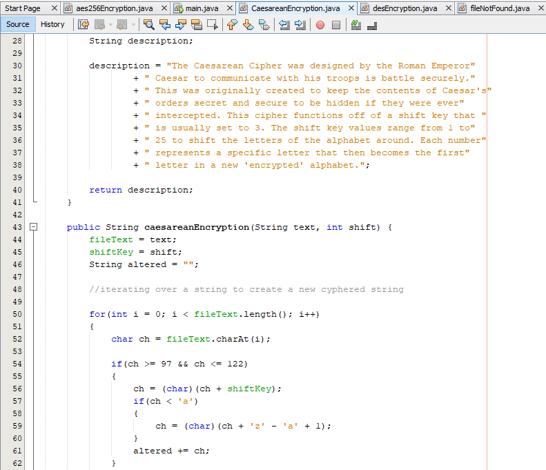
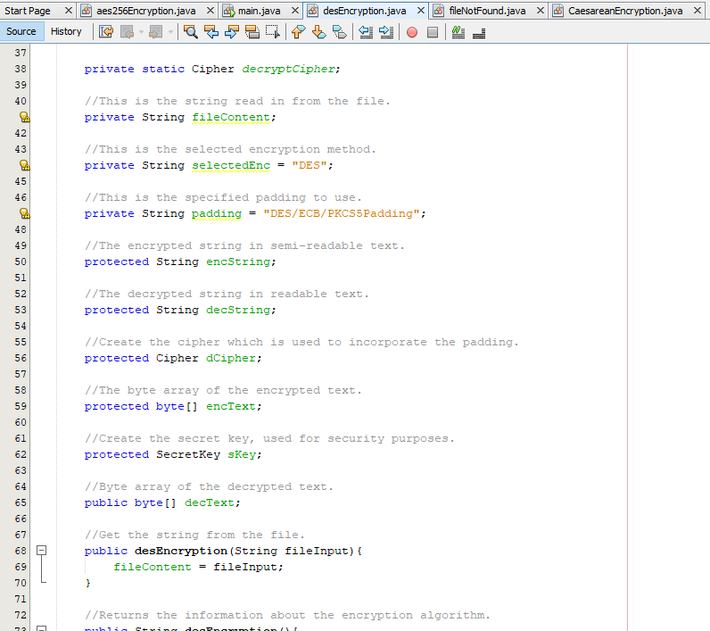
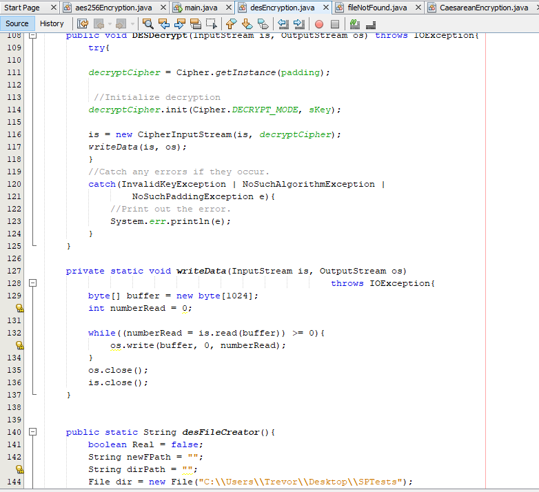
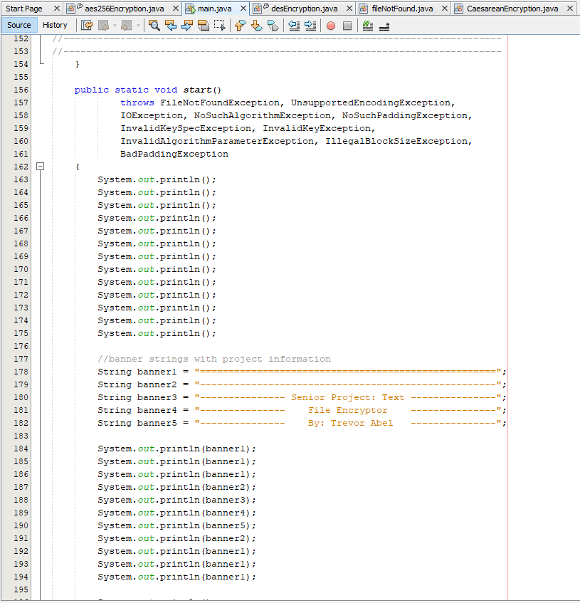
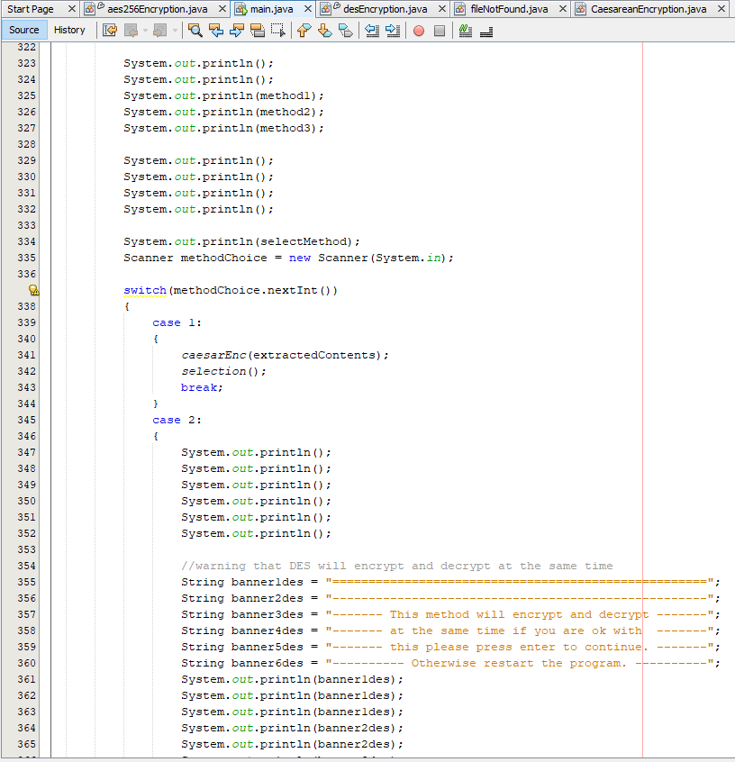
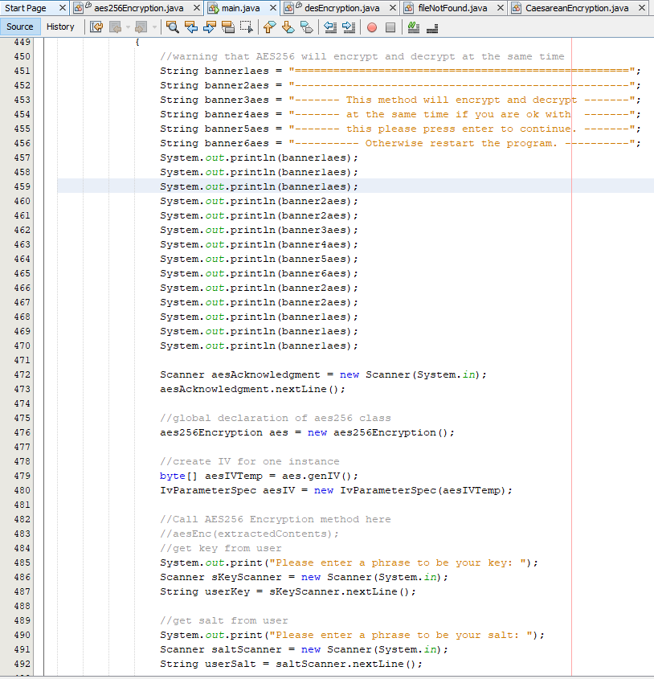
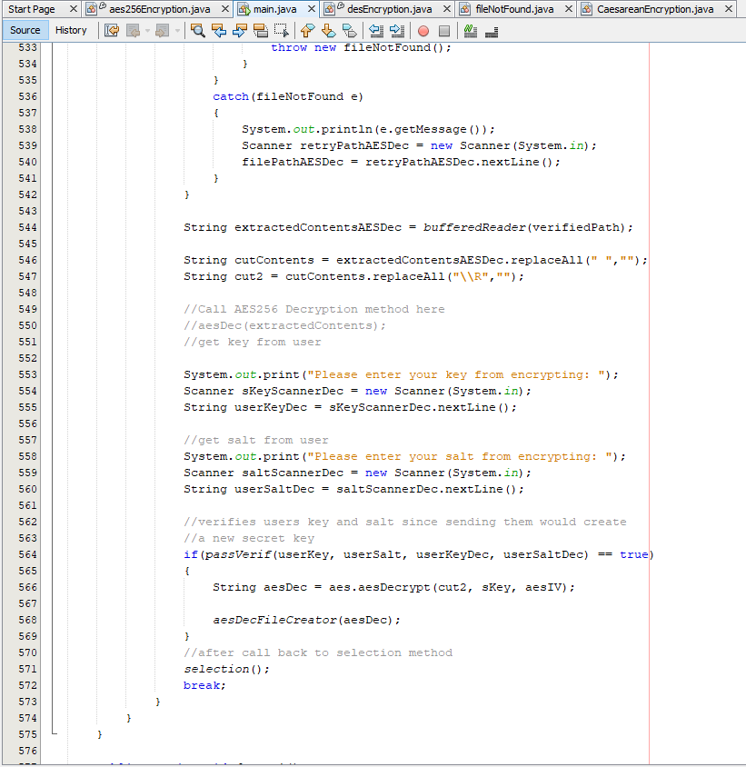
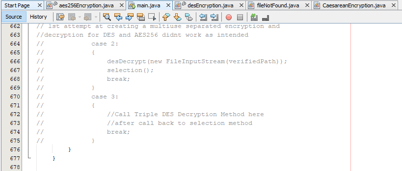
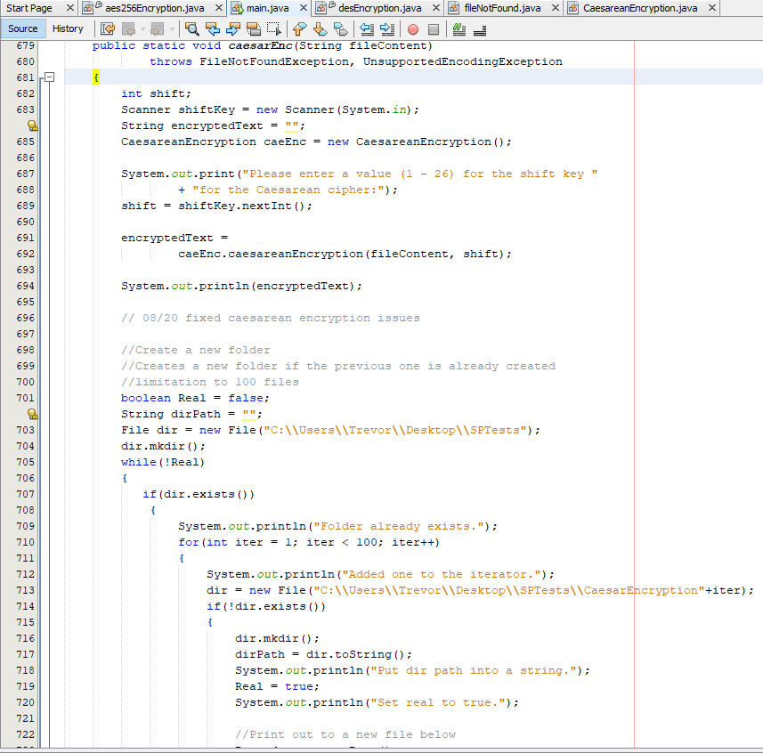
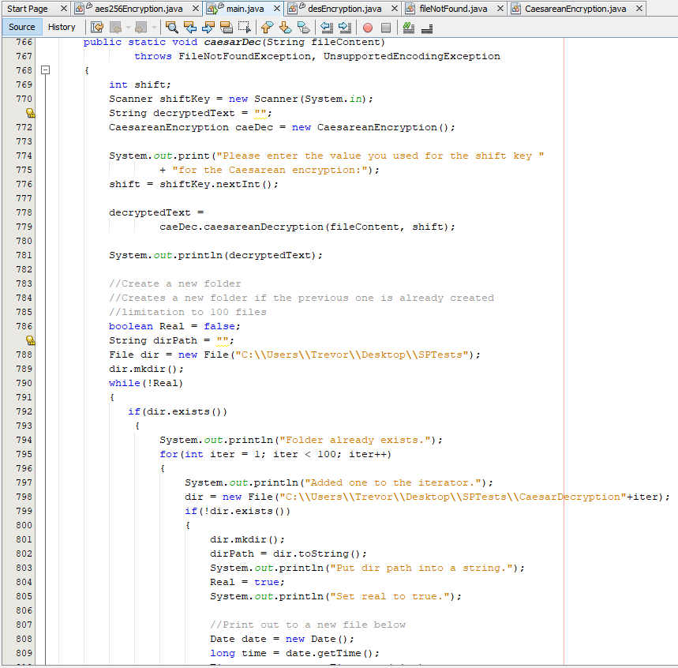

### [Back to Portfolio](index.md)

### [Back to Table of Contents](seniorproject.md)

### [View Full Report Here](fullReport.md)

Implementation Description & Explanaiton
====================
Introduction
------------
This project, the text file encryptor project, is a culmination of all the information that has been presented in the Computer Science classes offered at Charleston Southern for the Bachelor's degree in Cyber Security. The project is in fulfillment of the requirements of graduation and is the focus of the senior project sequence where the Text File Encryptor was developed. This project was designed, coded, tested, and completed within the sequence of the senior project classes starting at CSCI 497, Senior Project Design, and going through CSCI 499 Senior Project Defense. 

Goals & Objectives
------------------
For the implementation of the file encryptor project, there are a few main goals. First, produce a fully working text file encryptor. Second, make this text file encryptor segmented in its respective areas so that the encryptor itself can be customized. Thirdly, have a working product that can be released for free to address the lack of free encryption choices for individual files and the lack of ability to choose the desired encryption method.
The objectives of this project include the following: develop a stronger understanding of Java-based security classes and structures, learn how to properly separate core functions of encryption from the rest of the program to create a program that is easier to modify, and produce a product that is a sufficient fulfillment of the senior project sequence for the requirements of graduating with a Bachelor's degree in Cyber Security from Charleston Southern University.

Tasks
-----
For this project, it is broken down into simple stages for the components that are necessary for this project to be fully functional.

1. Caesar Encryption
2. Caesar Decryption
3. DES Encryption
4. DES Decryption
5. AES256 Encryption
6. AES256 Decryption
7. Functionality for recursion to repeat encryption/decryption
8. Functionality for File input validation
9. Functionality for saving a file directly to the desktop/specific folder
10. Functionality for creating a new folder automatically for each new encryption and decryption
11. UI for navigating through the program
12. BufferReader for reading the original file and converting it to a string
13. Creating FileNotFoundException for invalid file location call

Implementation Schedule
-----------------------

- Feb. 28, 2020
  - Implemented System Baseline
    - Caesarean Encryption/Decryption
    - File Path Searching
    - Oupting encrypted or decrypted files to new files created files
    - Input validation for file path searching
    - BufferReader method to pass file contents into a string
    - FileNotFounException

- May 20, 2020
  - Completed encryption or decryption choice at the beginning of the program
  - Implement recursion within the program to encrypt/decrypt multiple files in one program run
  - Completed the rerouting of the program-created encrypted and decrypted files back to the desktop instead of the java project folder

- Nov. 20, 2020
  - Implemented DES encryption/decryption and tested for accuracy

- Jan. 11, 2021
  - Implemented AES256 and tested for accuracy

- Jan 12, 2021
  - Begin testing and collecting usability and bug case information for project defense

Code Screenshots
----------------

Fig. 1 FileNotFound class that throws the Invalid File Location error when an improper path is entered while searching for a file.

Fig. 2 Caesarean Encryption global variables, constructor, passing file contents, and description methods.

In this image it shows the constructor for the Caesarean Encryption class, the method that passes only the text into the class, and the beginning of the description of the cipher.

Fig. 3 The description of the Caesarean encryption method and the beginning of the actual encryption.

Fig. 4 The rest of the Caesarean encryption method and the beginning of the decryption method.

For the encryption, it shows how when the file contents and the selected shift key are passed through that the for loop works one character at a time when switching to the shifted ciphertext. In the if loop within the for loop it shows that the way that the characters are determined is by their ASCII values so values 97 through 122 represent the lower case characters while 65 through 90 represent the upper case characters. For both upper and lower case the process is similar so it takes character variable ch and pulls one character from the fileText string variable that has the whole contents of the file. Next, the selected character is run through another if loop that checks to see what the current value is so that it can acurately loop back to the start of the alphabet for the respective case of that character. After that the character is passed to the string variable called altered, this variable stores each character that has been changed until the orginal string has been completed changed by the shift key. Then the string is passed to be stored into a new file to mark the ned of the encryption.

Fig. 5 Decryption of Caesarean encrypted text and other methods to get and set information for the encryption.

For the decryption of the Caesarean encryption method it is the same as described for Fig. 3 and Fig. 4 but instead of encrypting the contents it decrypts it. So everything is the same until it gets to modifying the character itself at which point it works backwards or the opposite way that the encryption shifting works. Similarly, the character variable ch for the currently shifted or to be shifted variable is stored after being shifted into the string variable called decCae. Then that string variable is returned to be stored into a new file to complete the decryption.
The methods getShiftKey and setShiftKey both deal with the value of the shift key for the instance of the Caesarean encryption class. The getShiftKey is useful for if you forget the shift key and have not moved to another instance. While the setShiftKey is useful for adjusting the shift key if necessary for whatever reason.

Fig.6 Shown in this image are all the libraries necessary for the function of the DES encryption class.

Fig. 7 Displays all the global variables for the DES encryption class.

In Fig. 6 and Fig. 7 it shows all the libraries and all of the global variables for the functionality of the DES encryption class. Some of these variables like selectedEnc and padding are not necessary they just save space when typing out their respective parts during the coding of the actual encryption. These variables are just prematuraly declaring the type of encryption and the type of padding to use for the DES encryption and decryption.

Fig. 8 DES Encryption description and the encryption method for DES.

In the encryption of DES it shows that the variables passed in are types inputstream and outputstream. Additionally there is an exception that is thrown which is the IOExecption otherwise not throwing it will not allow the method to work. First the KeyGenerator library is used to prepare to generate the secret key. The globabl variable sKey is used to store the key generated by the KeyGenerator library instance. With the encryptCipher variable it is setting up for the type of padding being used for the DES encryption. Then the encryptCipher varable is used to generate the DES encryption to be used to encrypt the file text.
Then an output stream is created so that the encryption can be written out to a new file. Then the methods writeData is called using the is, inputstream variable, which holds the contents of the file and os, the path of the new file.

Fig. 9

Similarly to Fig. 8 the decryption uses the same structure to generate with padding and then the variable decryptCipher to create the decryption to be used against the is variable that holds the file text. The writedata method is responsible for pushing the encrypted or decrypted text out to the new file to mark the end of the encryption or decryption. 

Fig. 10 The desFileCreator method is used in the main class to create the new file for that encryption.

First it catches everything into a while loop where the condition is !real which means not real, the real variable is a boolean variable that by default is set to false so once its set to true it exits. The purpose of this is the real variable is the only variable controlling the loop until a file name is available. Then it steps into the if loop where the major condition is if the the directory file exists if so then it enters a for loop where it goes up to 100 times per encryption or decryption, so up to a total of 200 times for the pairs of encryption and decryption.
Then the file path is broken down into parts so that an iterator can add one and keep the same name with a different number to be able to create new linkable files. Once a new file name is found it spits back information that lets the user know that the new path has been put into a string to be used for creating the file. Then says sets real to true which means that it has found a real file name. Then using the new file path string a file name is attached which is DESEncrypted.txt, all DES encrypted files have this name but are separated by their folder number in the order they were made.

Fig. 11 Contains the final steps of desFileCreator in which the new path is passed so the file is created at that path and shows the start of the decryption version of the same file creator.

Fig. 12 Shows the end of the desFileCreatorDec which is the same as the encryption version just specialized specifically for decryption.

The above desFileCreatorDec is exactly the same as the desFileCreator the only difference is instead of naming the files and folders DESEncrypted/DESEncryption# it is DESDecrypted/DESDecrypted#. Then using the new file path string a file name is attached which is DESDecrypted.txt, all DES decrypted files have this name but are separated by their folder number in the order they were made.

Fig. 13

Fig. 14

Fig. 15

Fig. 16

Fig. 17

Fig. 18

Fig. 19

Fig. 20

Fig. 21

Fig. 22

Fig. 23

Fig. 24

Fig. 25

Fig. 26

Fig. 27

Fig. 28

Fig. 29

Fig. 30

Fig. 31

Fig. 32

Fig. 33

Fig. 34

Fig. 35

Fig. 36

Fig. 37

Fig. 38

Fig. 39

Fig. 40

Fig. 41

Fig. 42

Fig. 43

Fig. 44

