### [Back to Portfolio](index.md)

### [Back to Table of Contents](seniorproject.md)

### [View Full Report Here](fullReport.md)

Implementation Description & Explanaiton
====================
Introduction
------------
This project, the text file encryptor project, is a culmination of all the information that has been presented in the Computer Science classes offered at Charleston Southern for the Bachelor's degree in Cyber Security. The project is in fulfillment of the requirements of graduation and is the focus of the senior project sequence where the Text File Encryptor was developed. This project was designed, coded, tested, and completed within the sequence of the senior project classes starting at CSCI 497, Senior Project Design, and going through CSCI 499 Senior Project Defense. 

Goals & Objectives
------------------
For the implementation of the file encryptor project, there are a few main goals. First, produce a fully working text file encryptor. Second, make this text file encryptor segmented in its respective areas so that the encryptor itself can be customized. Thirdly, have a working product that can be released for free to address the lack of free encryption choices for individual files and the lack of ability to choose the desired encryption method.
The objectives of this project include the following: develop a stronger understanding of Java-based security classes and structures, learn how to properly separate core functions of encryption from the rest of the program to create a program that is easier to modify, and produce a product that is a sufficient fulfillment of the senior project sequence for the requirements of graduating with a Bachelor's degree in Cyber Security from Charleston Southern University.

Tasks
-----
For this project, it is broken down into simple stages for the components that are necessary for this project to be fully functional.

1. Caesar Encryption
2. Caesar Decryption
3. DES Encryption
4. DES Decryption
5. AES256 Encryption
6. AES256 Decryption
7. Functionality for recursion to repeat encryption/decryption
8. Functionality for File input validation
9. Functionality for saving a file directly to the desktop/specific folder
10. Functionality for creating a new folder automatically for each new encryption and decryption
11. UI for navigating through the program
12. BufferReader for reading the original file and converting it to a string
13. Creating FileNotFoundException for invalid file location call

Implementation Schedule
-----------------------

- Feb. 28, 2020
  - Implemented System Baseline
    - Caesarean Encryption/Decryption
    - File Path Searching
    - Oupting encrypted or decrypted files to new files created files
    - Input validation for file path searching
    - BufferReader method to pass file contents into a string
    - FileNotFounException

- May 20, 2020
  - Completed encryption or decryption choice at the beginning of the program
  - Implement recursion within the program to encrypt/decrypt multiple files in one program run
  - Completed the rerouting of the program-created encrypted and decrypted files back to the desktop instead of the java project folder

- Nov. 20, 2020
  - Implemented DES encryption/decryption and tested for accuracy

- Jan. 11, 2021
  - Implemented AES256 and tested for accuracy

- Jan 12, 2021
  - Begin testing and collecting usability and bug case information for project defense

Code Screenshots
----------------

Fig. 1 FileNotFound class that throws the Invalid File Location error when an improper path is entered while searching for a file.

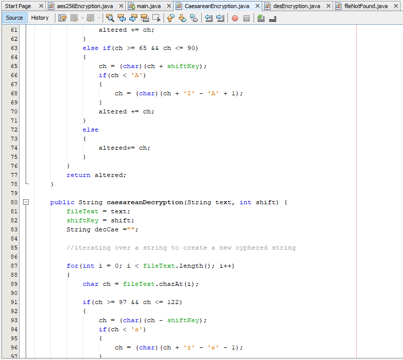

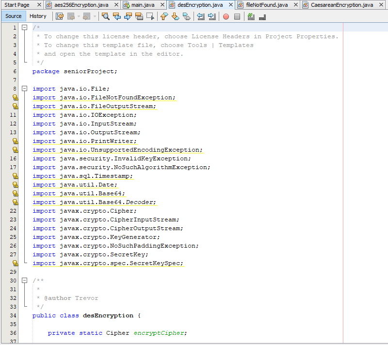

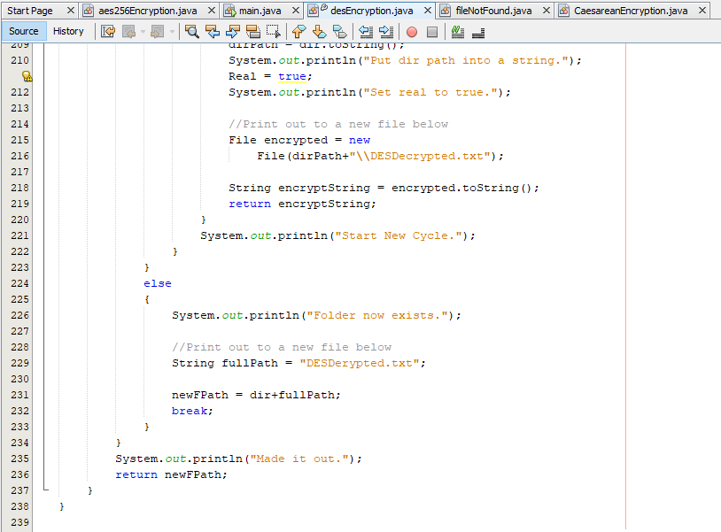

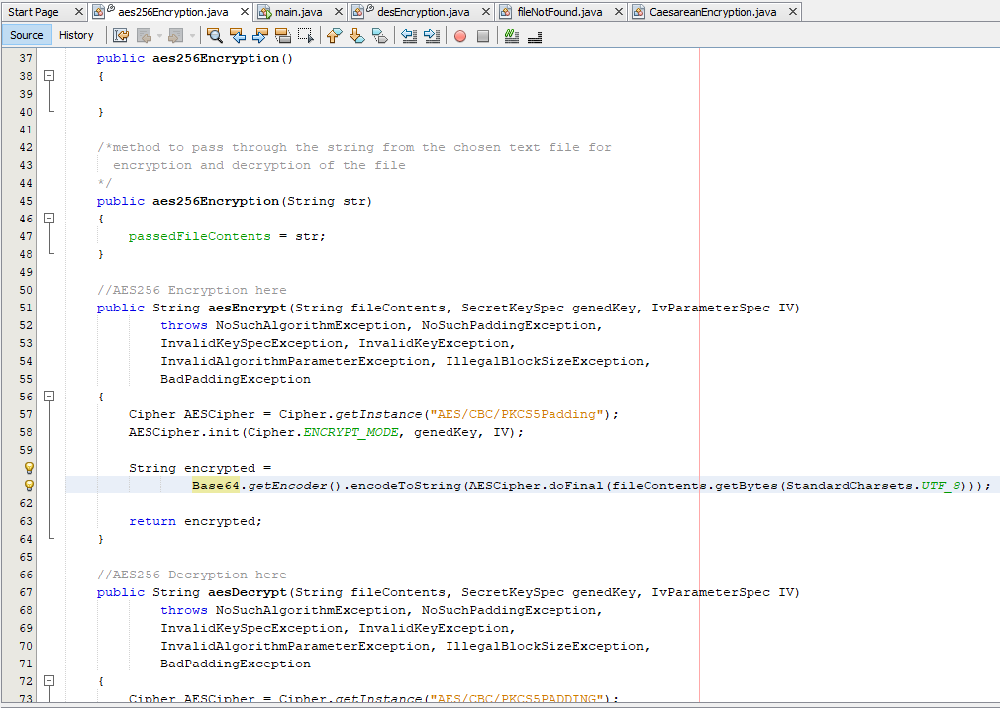

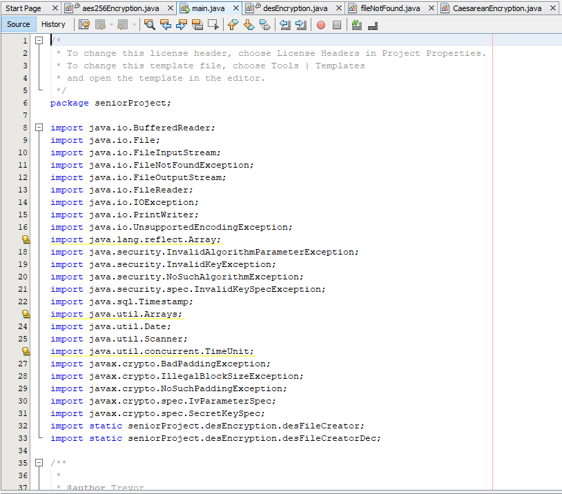

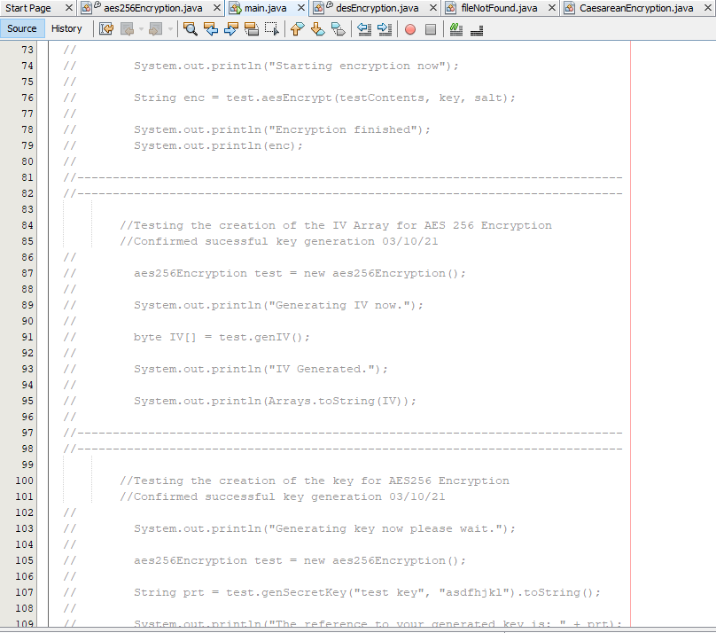

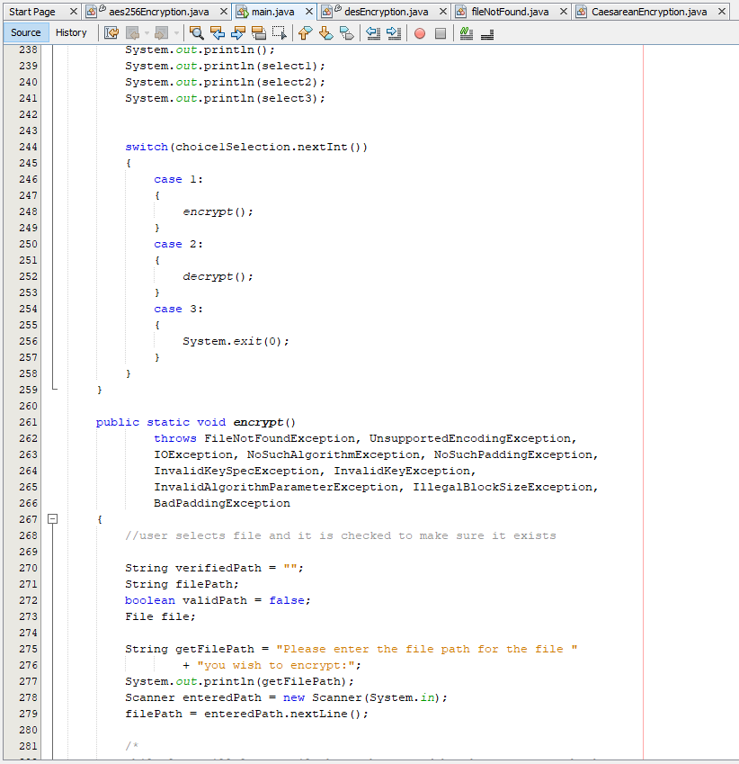
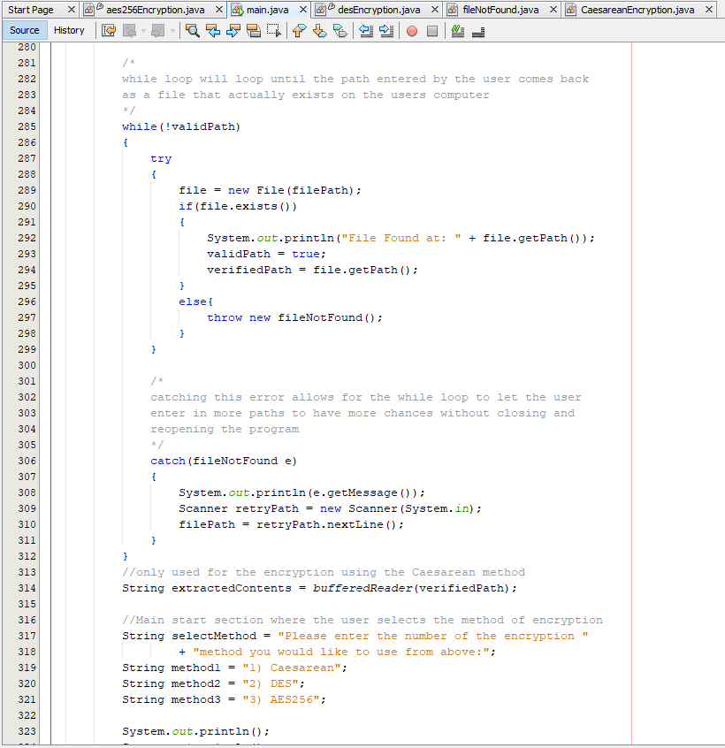

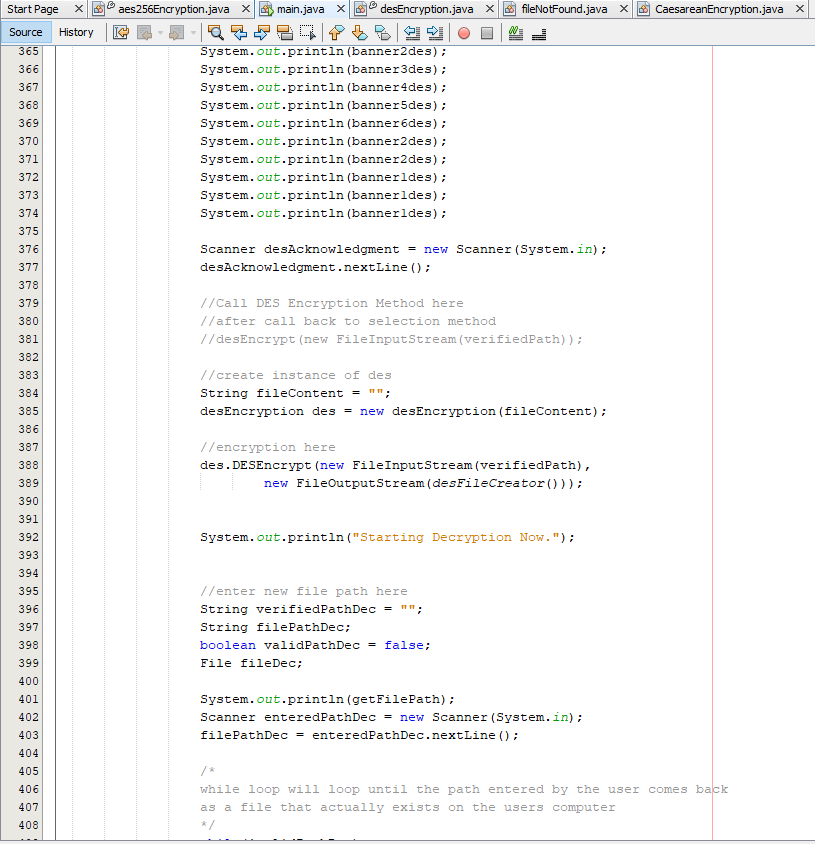

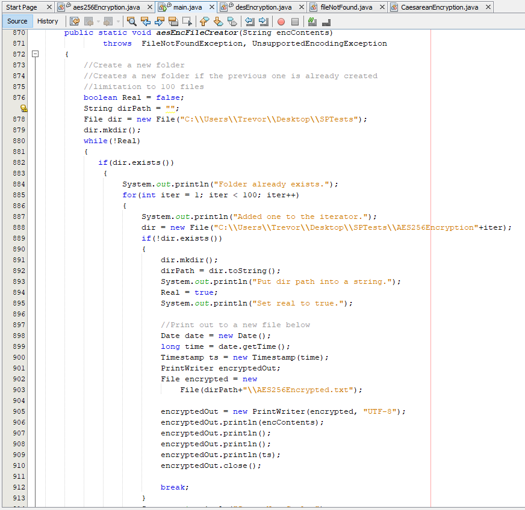

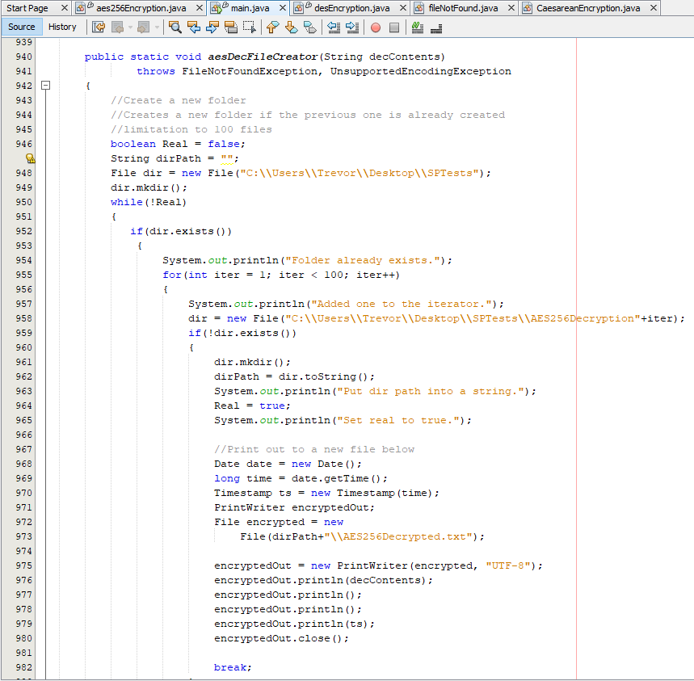
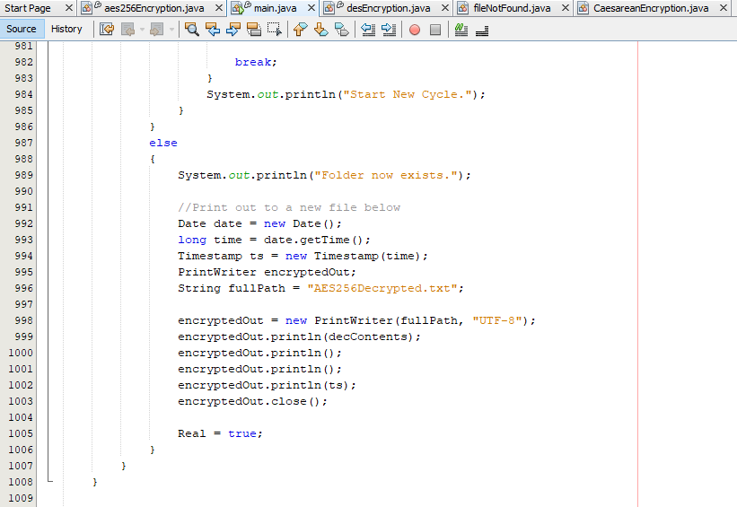
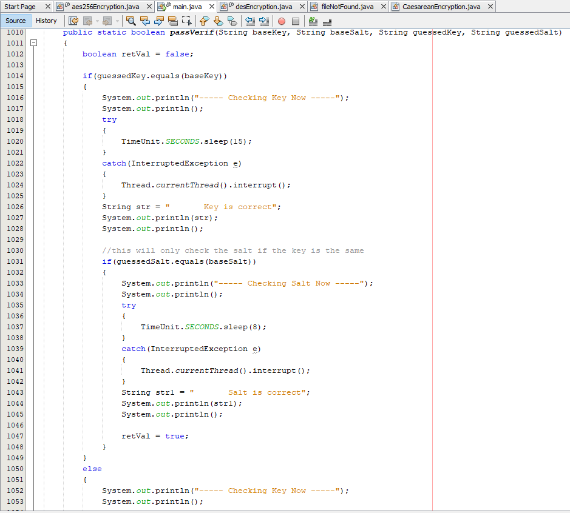

