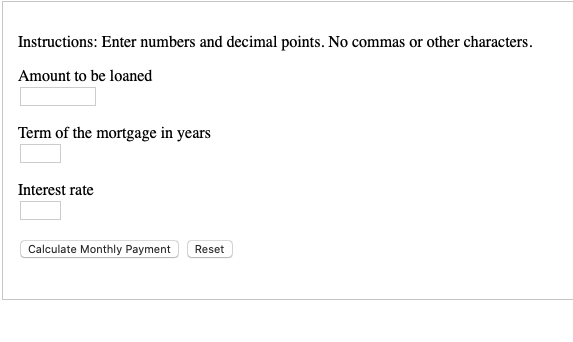
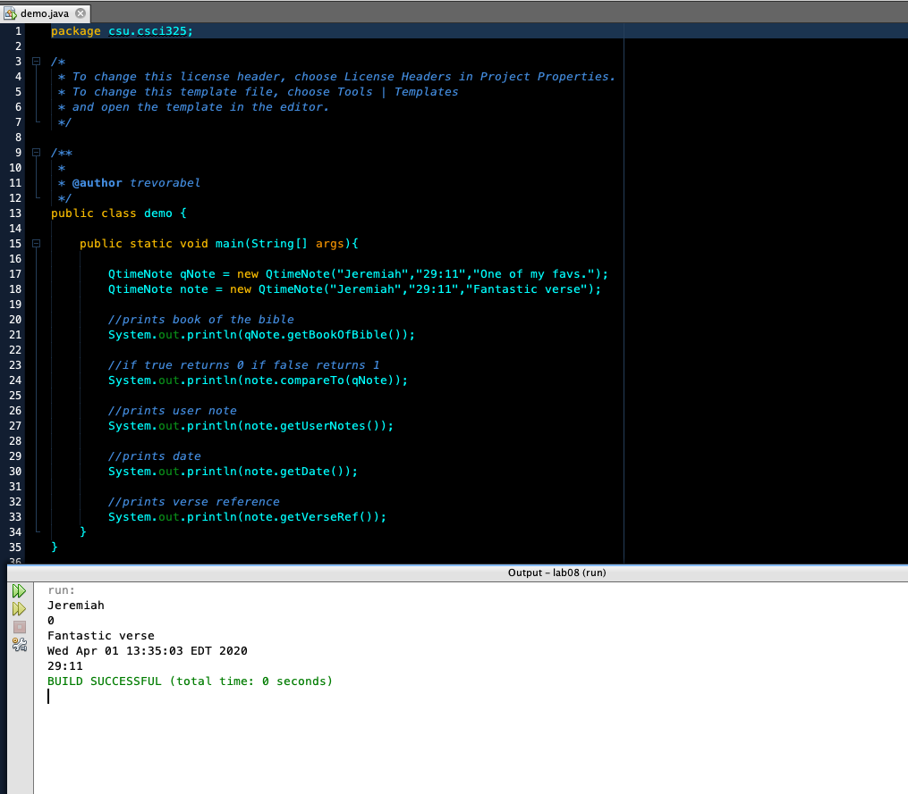
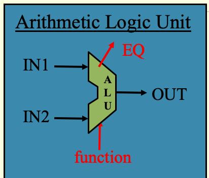

Portfolio
=========

Programming Projects
--------------------

*For access to my private project repositories, please [email me](mailto:taabel@csustudent.net?subject=GitHub%20Access) with the subject line, GitHub Access.

---
### [Mortgage Calculator | CSCI 301](project1)

---
### [Book Refrencing | CSCI 325](project1)

---
### [Arithmetic Logic Unit | CSCI 330](project1)

---
### [Client-Server Communication | CSCI 332](project1)

---

Ethics Papers
-------------

### [Paper 1 Title](/pdf/sample_presentation.pdf)

-   **Class:**  
-   **Grade:**

### [Paper 2 Title](/pdf/sample_presentation.pdf)

-   **Class:** 
-   **Grade:**

### [Paper 3 Title](/pdf/sample_presentation.pdf)

-   **Class:** 
-   **Grade:**

---

Presentations
-------------

### <a href="https://github.com/trevorabel/trevorabel.github.io/tree/master/powerpoints"> Cicada 3301 </a>

- **Class:** CSCI 405 Introduction to Cyber Security
- **Grade:** 100

### <a href="https://github.com/trevorabel/trevorabel.github.io/tree/master/powerpoints"> Muxes </a>

- **Class:** CSCI 330 Computer Architecture
- **Grade:** 100
- **Muxes Recording:** <a href="https://youtu.be/RlPTJElZgoQ"> Youtube </a>
---

Page template forked from <a href="https://github.com/csu-cs/csci-portfolio">CSU-CS</a>

<!-- Remove above link if you don't want to attributive -->
