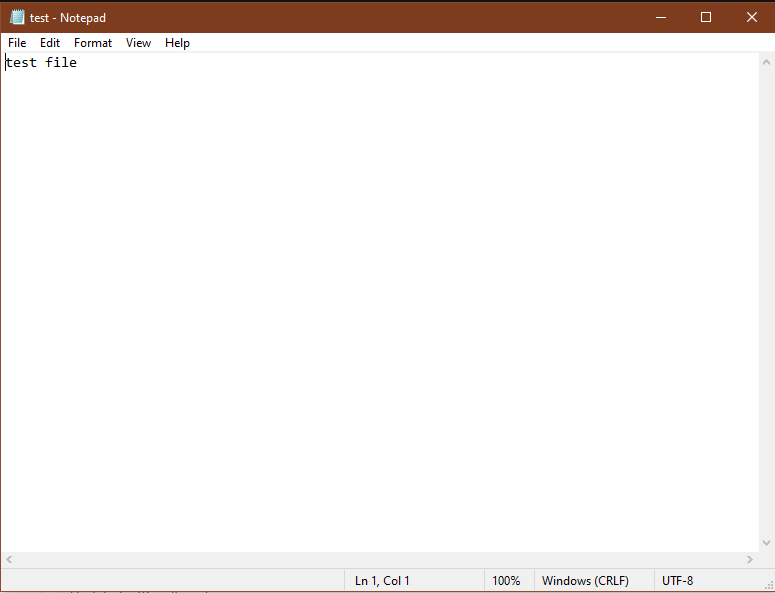
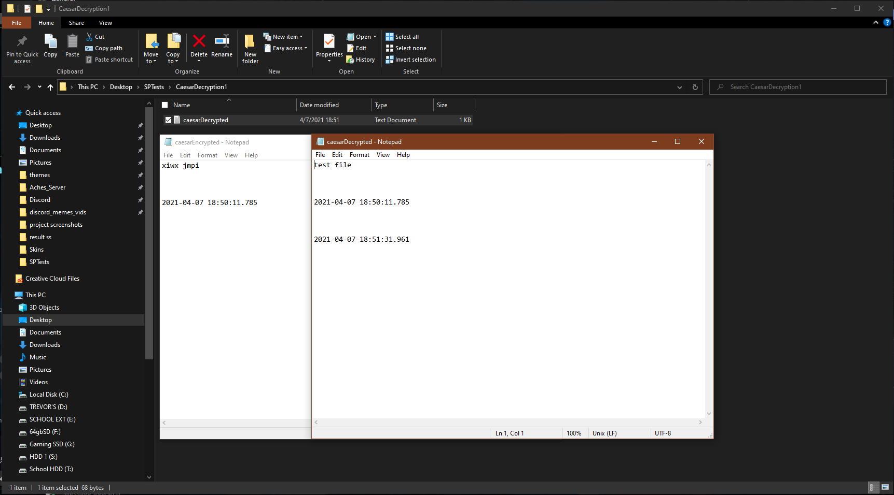
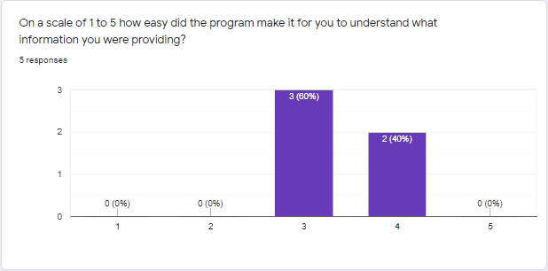
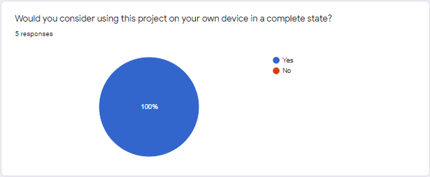
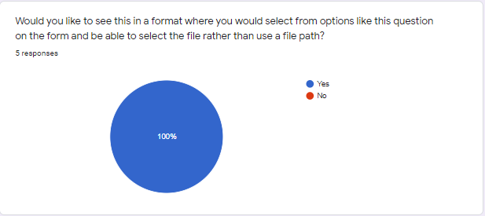

### [Back to Portfolio](index.md)

### [Back to Table of Contents](seniorproject.md)

### [View Full Report Here](fullReport.md)
Test Results
====================
For the test results of the File Encryptor project, they were as expected with the response on the user interface and the functionality of the project itself. In regards to the project's functionality, the project worked in every aspect except for the AES256 Decryption method. This was due to while running the program under one instance so the IV and the secret key would remain the same, when attempting to decrypt it would encounter three errors: base64 decoding error, and 2 invalid character errors. Resolving the base64 decoder error would cause one of the invalid character errors to pop up and resolving that error made the other one pop up. However, instead of resolving the issue after resolving the second illegal character error, it would bounce back to a base64 decoder error at which point attempting to resolve that error would lead to a repeat of the order of the errors with no end to them.

Due to this issue within the program, the program can operate fully as intended on the initial design. Additionally, it is different from the original design because I could not get the keys for DES and AES256 to be saveable to match against for decryption, later on, to encrypt multiple files at once. This was due to instancing and once a new instance is created there is currently no way to verify even if the key is saved accurately to decrypt the files later on. So, to solve this issue the step that was taken was to do encryption and decryption within one instance which means the program functions by encrypting then decrypting right after since the instance is the same and it can be verified for decryption. These two key issues aside the rest of the program functions as intended each supporting method for the main and individual classes fulfills its purpose and the Caesarean encryption method works with encrypting multiple files without having to decrypt right after encrypting like the original design of the project.

For the testing of the project, I selected 5 individuals to test the functionality and user interface of the project. These were the two main foci of the project this is because the level at which I designed the product is the average consumer who knows nothing about encryption or programming. However, this project can also cater to those who are versed in either encryption and or programming. Since this project was designed with the average user in mind the 5 individuals for the testing had little to no experience in programming or encryption. This was to achieve results that could reflect the interactions of the average user to better interpret the current design's effectiveness on accomplishing the main goal of being usable by the average user.

For each individual, they did a Caesarean and a DES encryption and decryption since both methods were fully functional, unlike AES256 decryption. The file used for all of these tests was test.txt which contains the following:

Example ouput from Caesar encryption and decryption:

Example output from DES encryption and decryption:

Example output from AES256 encryption only:

Questionnaire results
====================
After the testing was complete I had each participant fill out an anonymous form on google forms asking about their programming background, their overall experience with the user interface, and asking how they viewed planned enhancements for the future version of the project.

Programming Background
----------------------------------

We can see here that the majority of the testers have little to no experience which is the main target demographic for this test since the audience for this project is the general populous.

Overall Experience
----------------------------------

Overall, the demographic chosen for testing the project was received well. However, it was also identified that more changes are needed to make this product, even more, user-friendly and easy to understand. While the program already tells the user to do there are more efficient ways to achieve this goal and those ways are preferred by those who tested this program. So implementing a selectable pop-up box for the user to select a file in rather than type the file path name like in the current iteration of the project. These features except the AES256 decryption fix are not major fixes but more quality-of-life or minor fixes to make the program much more appealing to the user to use.
With the AES256 decryption, however, that is a fundamental piece that is must be resolved for this program which is why it is different from the other quality-of-life user fixes and also why it is first on the list of proposed future enhancements to display that it is first on the list of issues to resolve.

Planned Future Enhancements Responses
-------------------------------------

Planned future enhancements for this project include overhauling it to resolve the looped error for AES256 decryption. Overhaul the user interface into a JavaFX program so that the elements of information and interaction are more pleasing to the eye and better for interacting with. Additionally, I surveyed whether or not in a finished state they would recommend this to someone looking for encryption. These results showed overwhelming support for this project in a refined state with the described overhauls and there were no additional comments on the anonymous forms. I believe this is because what was mentioned in the planned future enhancements questions addressed any concerns or potential places of improvement that the participants would have commented on.

In all, the project was a success the program functioned like it was supposed to, for the most part, while there were bumps on the way like the DES and AES256 instancing issues that had to be resolved. There was only one major problem that prevented the project from performing to its full expectation, that issue is the AES256 decryption method but it will be addressed in future enhancements. I searched and searched for a way to resolve each new issue from that method when fixing the first one however it leads to an infinite loop of issues when trying to resolve it. So, AES256 decryption had to be temporarily considered as a missing element but AES256 encryption was working so it was tested to show that it performs as expected.
Additionally, there are user interface changes that I had thought about after finishing the project and writing the report as ways to make it more user-friendly and easy to understand for the user. Those ideas were weaved into the Planned Future Enhancements questions in the questionnaire that was given to the participants after completing the testing. These were all received well and showed that as representatives of the general populous that these would be most beneficial for the general populous. This is because the general populous has little to no programming experience and almost no encryption experience.
So implementing these enhancements will make it easier for those individuals to use this system and be able to have some form of encryption for their files.
